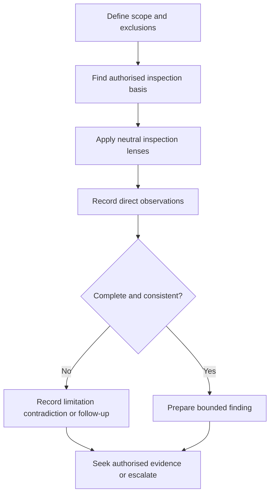
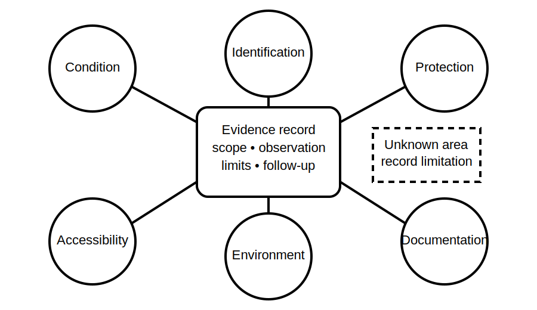

# Structured Visual Inspection

## 1. Outcome and entry check
By the end, the learner can organise a visual inspection by scope, evidence category and unresolved question, and can distinguish direct observation from interpretation and compliance judgement.

**Entry check:** Given a photograph of a fictional installation, write one observation that does not assume cause, compliance or hidden condition.

## 2. Why it matters
Unstructured looking produces omissions and overclaiming. A repeatable inspection framework helps the learner notice condition, identification, accessibility, protection and documentation issues while preserving the boundary between what is visible and what still needs verification.

## 3. Core concepts and terminology
- **Inspection scope:** the equipment, location, condition and exclusions covered.
- **Direct observation:** a visible fact recorded without inferred cause.
- **Inspection lens:** a category used to guide attention consistently.
- **Limitation:** anything that prevents a complete observation.
- **Contradiction:** disagreement between visible condition, labels or documents.
- **Follow-up question:** an unresolved matter requiring another evidence source.
- **Bounded finding:** a statement limited to the evidence actually available.

## 4. Rule-finding workflow
1. Define the item, operating context and inspection boundary.
2. Locate the current authorised inspection requirements for that scope.
3. Convert requirements into neutral inspection lenses rather than copied wording.
4. Observe systematically: condition, identification, protection, accessibility, environment and documentation.
5. Record only what is directly visible or reliably established.
6. Mark inaccessible areas, contradictions and evidence gaps.
7. Link each unresolved item to the evidence needed next.
8. Stop before assigning a compliance or defect category without authorised criteria and competent review.

## 5. Visual model or worked example

**Worked example:** In a fictional switchboard image, a label is damaged and one enclosure area is obscured. The learner records the damaged label and obstruction as observations, notes that internal condition is unknown and avoids inferring the circuit identity or defect category.

## 6. Practical application
Review a fictional room, board and equipment image set. Produce an inspection record with scope, six lens headings, direct observations, limitations, contradictions, follow-up evidence and a bounded summary.

Assessment evidence: complete scope statement, neutral observations, consistent lens use, explicit unknowns, traceable follow-up questions and no unsupported compliance conclusion.

## 7. Common errors and safety checkpoint
Common errors include using a memory checklist as if authoritative, describing inferred causes as facts, overlooking inaccessible areas, treating labels as proof, inspecting without a defined boundary and assigning defect severity from appearance alone.

**Safety checkpoint:** This module does not authorise opening equipment, removing covers, approaching exposed live parts or performing field inspection. Actual inspection scope, access controls, sequencing and acceptance criteria require current authorised sources, approved procedures and competent persons.

## 8. Retrieval and next links
Name six inspection lenses, then convert one judgemental statement into a direct observation plus a follow-up question.

- Previous: [Block 36 — Verification Evidence Model](block-36-verification-evidence-model.md)
- Next: [Block 38 — Mandatory Test Purposes](block-38-mandatory-test-purposes.md)
- Knowledge note: [Structured Visual Inspection](../../../knowledge-base/9-week/Block 37 - Structured Visual Inspection.md)