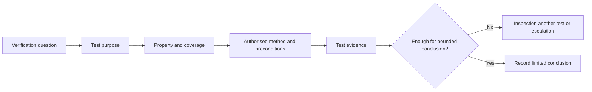
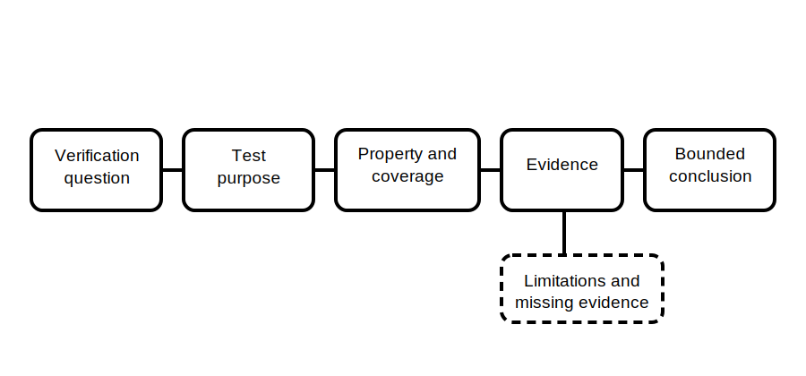

# Mandatory Test Purposes

## 1. Outcome and entry check
By the end, the learner can explain why a verification test exists, identify the property it seeks to evidence and state what a result cannot prove on its own.

**Entry check:** Explain the difference between naming a test and explaining the safety question that test is intended to answer.

## 2. Why it matters
Memorising test names without purpose encourages mechanical procedure-following and overinterpretation. Purpose-first reasoning connects each authorised test to a defined verification question, evidence type and limitation.

## 3. Core concepts and terminology
- **Test purpose:** the safety or functional question a test is intended to inform.
- **Property under test:** the characteristic being examined, such as continuity, separation, polarity or protective response.
- **Test evidence:** the observation or recorded result produced under an authorised method.
- **Coverage:** the part of the installation and question actually addressed.
- **Precondition:** a condition that must be established before a result is meaningful.
- **Limitation:** what the test does not establish.
- **Mandatory test set:** tests required for a defined scope by current authorised sources; the exact set is jurisdiction- and context-dependent.

## 4. Rule-finding workflow
1. Define the installation type, work scope and verification stage.
2. Find the current authorised source specifying required tests.
3. Record each required test by purpose, not copied procedural wording.
4. Identify the property, coverage and prerequisites.
5. Identify the evidence produced and how it must be recorded.
6. State what the result cannot establish independently.
7. Link unresolved matters to inspection, another test or competent interpretation.
8. Keep instruments, methods, limits and pass/fail criteria marked for authorised-source verification.

## 5. Visual model or worked example

**Worked example:** A fictional worksheet lists a continuity-related test. The learner identifies its broad purpose and coverage, then notes that a favourable observation does not by itself prove correct identification, overall compliance or performance under every condition.

## 6. Practical application
Given six fictional test labels and verification questions, match each label to a broad purpose category, property, expected evidence type, prerequisite and limitation. Flag every exact method, value and acceptance statement for reference checking.

Assessment evidence: purpose-first explanations, correct separation of property and conclusion, explicit coverage limits, appropriate cross-links to inspection and no invented procedure or value.

## 7. Common errors and safety checkpoint
Common errors include equating a test name with a complete method, assuming one result proves the whole installation, omitting prerequisites, confusing expected observation with acceptance criterion and recalling an outdated mandatory set from memory.

**Safety checkpoint:** This module does not specify the mandatory test set, test instruments, connection methods, energised testing steps, proving procedures, values or acceptance limits. Those require current authorised sources, approved procedures, suitable equipment and competent persons.

## 8. Retrieval and next links
For one fictional test, state its purpose, property, evidence, coverage and one limitation without describing how to perform it.

- Previous: [Block 37 — Structured Visual Inspection](block-37-structured-visual-inspection.md)
- Next: [Block 39 — Test-Order Reasoning](block-39-test-order-reasoning.md)
- Knowledge note: [Mandatory Test Purposes](../../../knowledge-base/9-week/Block 38 - Mandatory Test Purposes.md)