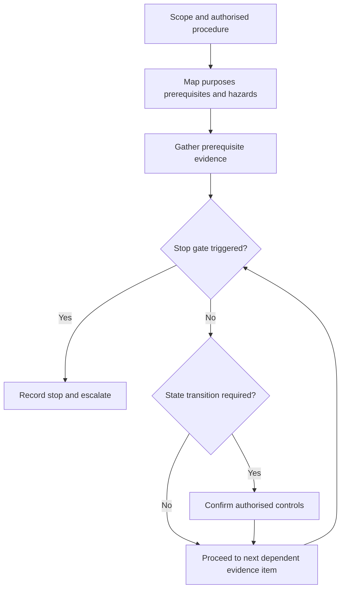
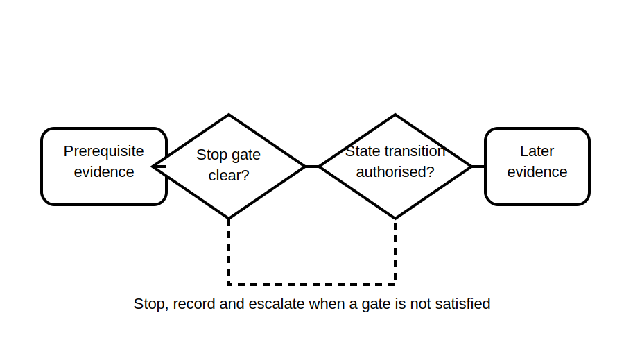

# Test-Order Reasoning

## 1. Outcome and entry check
By the end, the learner can justify a provisional verification sequence using dependencies, safety state, evidence preservation and stop conditions without presenting a memorised order as universally valid.

**Entry check:** Give one reason why the result of an earlier inspection or test may be needed before a later test can be interpreted safely.

## 2. Why it matters
Sequence is not merely administrative. One activity may establish a prerequisite, reveal a reason to stop, change installation state or affect later evidence. A defensible order therefore depends on scope and current authorised procedure, not a generic list recalled from memory.

## 3. Core concepts and terminology
- **Dependency:** evidence or condition required before another activity is meaningful.
- **Safety state:** the established condition under which an authorised activity may occur.
- **Non-energised evidence:** evidence obtained without intentionally energising the relevant test scope.
- **Energised evidence:** evidence requiring an authorised energised state and additional controls.
- **Evidence preservation:** avoiding actions that obscure, alter or invalidate earlier observations.
- **Stop gate:** a finding that prevents progression until resolved or escalated.
- **Provisional sequence:** an order awaiting confirmation against authorised requirements and site conditions.

## 4. Rule-finding workflow
1. Define the verification scope, installation state and responsible procedure.
2. Obtain the current authorised sequence requirements.
3. List every inspection and test purpose with prerequisites and hazards.
4. Map dependencies between evidence items.
5. Place inspection and lower-risk prerequisite evidence before dependent activities where authorised.
6. Identify every transition in isolation, connection or energisation state.
7. Insert stop gates for contradiction, unsafe condition, failed prerequisite or uncertain scope.
8. Confirm the final sequence, controls and competence requirements from authorised sources before action.

## 5. Visual model or worked example

**Worked example:** A fictional plan places an energised activity first. The learner identifies missing inspection evidence and an unconfirmed prerequisite, moves the item behind explicit gates and labels the revised sequence provisional pending authorised review.

## 6. Practical application
Given a shuffled fictional set of inspection and test-purpose cards, build a dependency graph. For each card, record prerequisites, installation state, evidence produced, possible effect on later evidence and stop conditions. Produce a provisional order with written justification.

Assessment evidence: accurate dependency reasoning, explicit state transitions, preservation of evidence, usable stop gates and refusal to claim a universal prescribed sequence.

## 7. Common errors and safety checkpoint
Common errors include memorising one order as universal, beginning with an energised activity without established prerequisites, ignoring how actions alter evidence, proceeding after contradictory findings and treating completion pressure as a reason to bypass a stop gate.

**Safety checkpoint:** This module does not provide a field test sequence, switching or isolation steps, energised test method, instrument setup or permission to proceed. Actual order and controls require current authorised sources, approved procedures, suitable equipment and competent persons.

## 8. Retrieval and next links
Explain dependency, safety state, evidence preservation and stop gate, then justify why a provisional sequence must be checked before use.

- Previous: [Block 38 — Mandatory Test Purposes](block-38-mandatory-test-purposes.md)
- Next: [Block 40 — Expected Observations and Contradictions](block-40-expected-observations-and-contradictions.md)
- Knowledge note: [Test-Order Reasoning](../../../knowledge-base/9-week/Block 39 - Test-Order Reasoning.md)