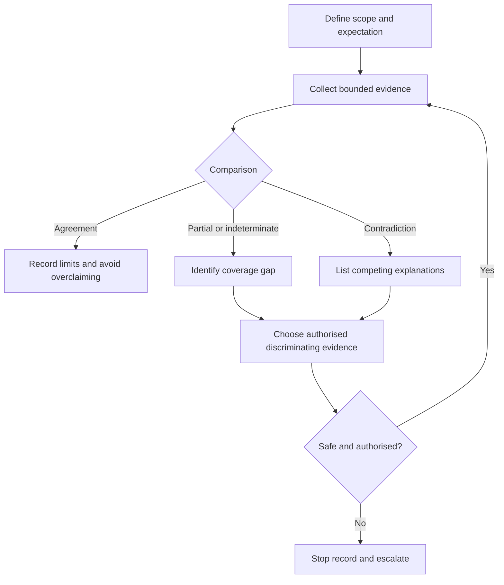
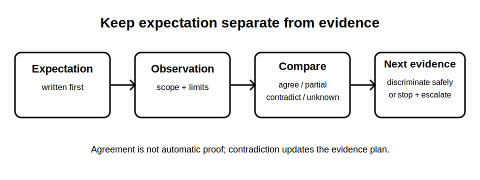

# Expected Observations and Contradictions

## 1. Outcome and entry check
By the end, the learner can state a bounded expected observation, compare it with evidence, classify agreement or contradiction, and choose a safe next evidence step without turning expectation into proof.

**Entry check:** Explain why an expected result written after seeing the evidence is weaker than one written beforehand.

## 2. Why it matters
Verification is vulnerable to confirmation bias. A learner who records the expected pattern before observation can detect mismatches rather than unconsciously explaining them away. Contradictions are useful evidence: they may reveal a wrong assumption, limited coverage, an altered installation state, unsuitable evidence, or a condition requiring escalation.

## 3. Core concepts and terminology
- **Expected observation:** a provisional evidence pattern derived from defined scope and authorised criteria.
- **Observed evidence:** what was actually seen, recorded or measured, including limitations.
- **Agreement:** evidence consistent with the bounded expectation; not automatic proof of compliance.
- **Contradiction:** evidence incompatible with one or more stated assumptions or expectations.
- **Coverage gap:** part of the claimed scope not supported by the evidence obtained.
- **Alternative explanation:** another plausible account that remains open until discriminating evidence is obtained.
- **Discriminating evidence:** evidence capable of separating competing explanations.

## 4. Rule-finding workflow
1. Define scope, installation state and the question being tested.
2. Locate current authorised criteria and identify any exact values requiring reference verification.
3. Record the expected observation before reviewing the result.
4. Record actual evidence separately, including uncertainty and coverage limits.
5. Compare expectation and evidence as agreement, partial agreement, contradiction or indeterminate.
6. List at least two plausible explanations for a contradiction where appropriate.
7. Select the least-assumptive discriminating evidence step allowed by authorised procedure.
8. Stop and escalate when scope, safety state, evidence validity or competence is uncertain.

## 5. Visual model or worked example

**Worked example:** A fictional inspection note predicts one labelled control point will cover the whole stated scope. The observed documentation shows an auxiliary source outside that boundary. The learner records a contradiction, keeps two explanations open, and requests source-state evidence rather than declaring the label wrong or the installation compliant.

## 6. Practical application
For four fictional evidence cards, write the prior expectation, actual observation, comparison class, competing explanations, coverage limitation and next discriminating evidence. Include one case where agreement still does not justify a compliance conclusion.

Assessment evidence: expectations written independently, neutral observations, explicit contradiction handling, sensible alternative explanations, bounded next steps and no unsupported acceptance decision.

## 7. Common errors and safety checkpoint
Common errors include rewriting the expectation after seeing the result, treating agreement as proof, explaining away contradictions, choosing evidence that cannot distinguish alternatives, ignoring coverage and continuing after an unsafe or invalid state change.

**Safety checkpoint:** This module does not prescribe observations, test values, acceptance criteria, instruments or field actions. Exact expectations and responses require current authorised sources, approved procedures, suitable equipment and competent review.

## 8. Retrieval and next links
Define expectation, contradiction, coverage gap and discriminating evidence. Explain why a contradiction should update the evidence plan rather than trigger an immediate conclusion.

- Previous: [Block 39 — Test-Order Reasoning](block-39-test-order-reasoning.md)
- Next: [Block 41 — Inspection-and-Test Integration Case](block-41-inspection-and-test-integration-case.md)
- Knowledge note: [Expected Observations and Contradictions](../../../knowledge-base/9-week/Block 40 - Expected Observations and Contradictions.md)
