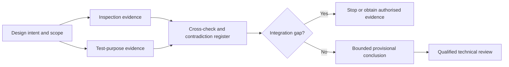
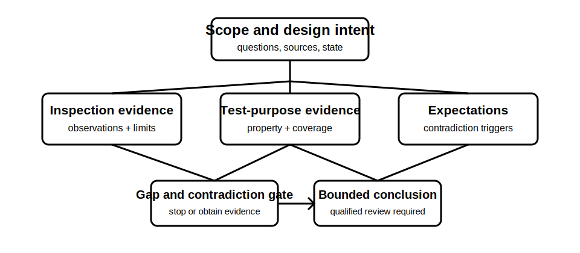

# Inspection-and-Test Integration Case

## 1. Outcome and entry check
By the end, the learner can assemble a traceable verification evidence plan for a fictional installation, linking design intent, visual observations, test purposes, sequence dependencies, expected evidence, contradictions and stop conditions.

**Entry check:** Name the six evidence layers introduced in Block 36 and give one reason they must not be collapsed into a single conclusion.

## 2. Why it matters
Verification decisions are rarely supported by one observation or one result. A defensible case connects multiple evidence types while preserving their scope and limitations. Integration also exposes gaps: a plausible result cannot compensate for missing inspection coverage, an invalid prerequisite or an unresolved contradiction.

## 3. Core concepts and terminology
- **Evidence plan:** a structured account of what evidence is needed, why, in what dependency order and under which controls.
- **Evidence chain:** traceable links from question to evidence, interpretation, criterion and bounded conclusion.
- **Cross-check:** comparison of independent evidence sources addressing the same claim.
- **Integration gap:** a missing or invalid link that prevents the evidence set supporting its intended conclusion.
- **Contradiction register:** a record of mismatches, competing explanations and unresolved next steps.
- **Conclusion boundary:** the narrowest claim justified by the available evidence and review status.

## 4. Rule-finding workflow
1. Define fictional installation scope, design intent and verification questions.
2. Identify current authorised sources that would govern criteria, test set and sequence.
3. Build a visual-inspection plan using neutral observation categories.
4. Map each test purpose to the property, coverage, prerequisite and evidence it would address.
5. Order activities by dependencies, safety state and evidence preservation.
6. Pre-record expected observations and possible contradiction triggers.
7. Assemble evidence, interpretation, criteria and limitations in separate columns.
8. Record integration gaps, stop conditions and matters requiring qualified technical review.

## 5. Visual model or worked example

**Worked example:** A fictional small installation includes a normal supply, an auxiliary source and incomplete circuit labels. The learner identifies what can be established visually, what test purposes would address remaining questions, which state transitions require gates, and why a satisfactory isolated result cannot resolve the auxiliary-source contradiction.

## 6. Practical application
Complete a one-page evidence pack for the fictional case: scope statement, source inventory, inspection observations, test-purpose matrix, dependency sequence, expected-observation table, contradiction register and conclusion boundary. Mark every exact criterion as `reference_check_required` unless supplied from a current authorised source.

Assessment evidence: coherent evidence links, independent cross-checks, visible limitations, correct stop gates, no invented values or procedures, and a conclusion narrower than the unresolved evidence gaps.

## 7. Common errors and safety checkpoint
Common errors include treating a checklist as an evidence argument, mixing observations with interpretations, allowing one favourable result to override missing coverage, inventing a test order, omitting alternative supplies and writing a compliance conclusion before criteria and contradictions are resolved.

**Safety checkpoint:** The case is educational and fictional. It does not authorise inspection, switching, testing, energisation, instrument use, defect classification or certification. Actual verification requires current authorised documents, approved procedures, suitable equipment and competent persons.

## 8. Retrieval and next links
From memory, reconstruct the evidence chain and identify three different integration gaps that would block a conclusion.

- Previous: [Block 40 — Expected Observations and Contradictions](block-40-expected-observations-and-contradictions.md)
- Next: [Block 42 — Rest, Reflection and Catch-Up](block-42-rest-reflection-and-catch-up.md)
- Knowledge note: [Inspection-and-Test Integration Case](../../../knowledge-base/9-week/Block 41 - Inspection-and-Test Integration Case.md)
