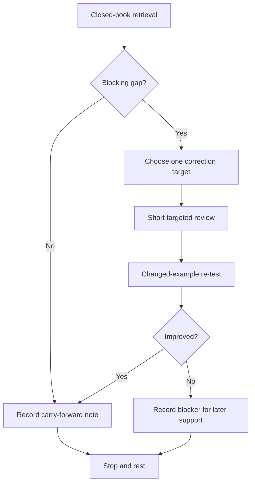
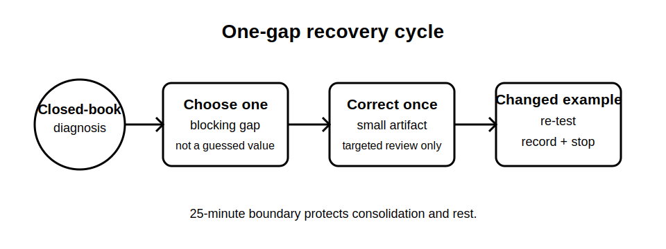

# Rest, Reflection and Catch-Up

## 1. Outcome and entry check
By the end, the learner can identify one blocking Week 6 verification gap, complete one bounded correction cycle, demonstrate improvement on a changed prompt and stop without turning recovery time into another full study session.

**Entry check:** Without notes, write the sequence: question, expected evidence, observation, interpretation, criterion, conclusion. Circle the first link you cannot explain clearly.

## 2. Why it matters
Recovery blocks protect retention and expose fragile knowledge before new material is added. Their purpose is not to finish every optional task. A short diagnostic, one targeted correction and a changed-example re-test provide better evidence of readiness than rereading the whole week.

## 3. Core concepts and terminology
- **Blocking gap:** missing understanding that prevents safe or meaningful progress.
- **Non-blocking gap:** incomplete detail that can be logged for later review.
- **Correction target:** the smallest concept or reasoning step chosen for repair.
- **Changed-example re-test:** a new prompt that checks transfer rather than recognition.
- **Recovery boundary:** a fixed time and scope limit protecting rest.
- **Carry-forward note:** a concise unresolved item recorded without attempting to solve it now.

## 4. Rule-finding workflow
1. Set a 25-minute recovery boundary.
2. Complete a six-minute closed-book retrieval across Blocks 36–41.
3. Classify errors as blocking, non-blocking or reference-dependent.
4. Select exactly one blocking gap; do not select a technical value or procedure for memory-based repair.
5. Review only the relevant module section and authorised reference boundary.
6. Produce one correction artifact: a diagram, evidence chain or contradiction table.
7. Re-test with a changed fictional example without notes.
8. Record the result, one carry-forward note and stop when the boundary is reached.

## 5. Visual model or worked example

**Worked example:** A learner can list test purposes but repeatedly mixes observation with interpretation. They review only the evidence-layer distinction, rebuild one fictional evidence row, then classify a changed example. An unresolved authorised criterion is logged rather than guessed.

## 6. Practical application
Use six prompt cards: evidence layers, inspection scope, test purpose, dependency order, expected observation and contradiction response. Score each as secure, fragile or blocked. Correct one blocked item and re-test it with a changed scenario.

Assessment evidence: honest diagnosis, one bounded correction, improved transfer on the changed prompt, a clear carry-forward note and compliance with the stop rule.

## 7. Common errors and safety checkpoint
Common errors include rereading everything, attempting multiple repairs, memorising exact values without an authorised source, selecting an easy non-blocking item, reusing the same example and extending the session beyond the recovery boundary.

**Safety checkpoint:** This block repairs reasoning only. It does not resolve technical criteria, authorise field work or remove any `reference_check_required` or `review-required` flag from earlier modules.

## 8. Retrieval and next links
State the one-gap recovery cycle from memory and explain why the changed-example re-test is stronger than immediate repetition.

- Previous: [Block 41 — Inspection-and-Test Integration Case](block-41-inspection-and-test-integration-case.md)
- Next: [Block 43 — Fault Diagnosis as Evidence Updating](block-43-fault-diagnosis-as-evidence-updating.md)
- Knowledge note: [Rest, Reflection and Catch-Up](../../../knowledge-base/9-week/Block 42 - Rest Reflection and Catch-Up.md)
