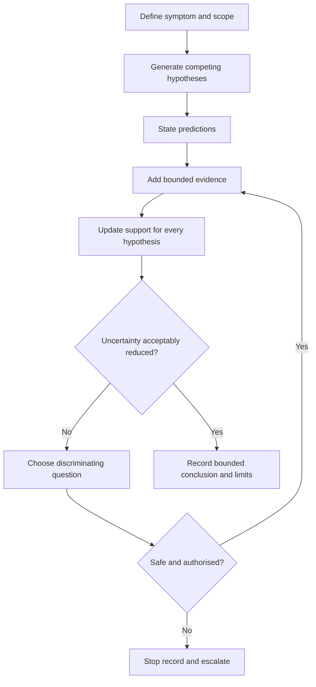
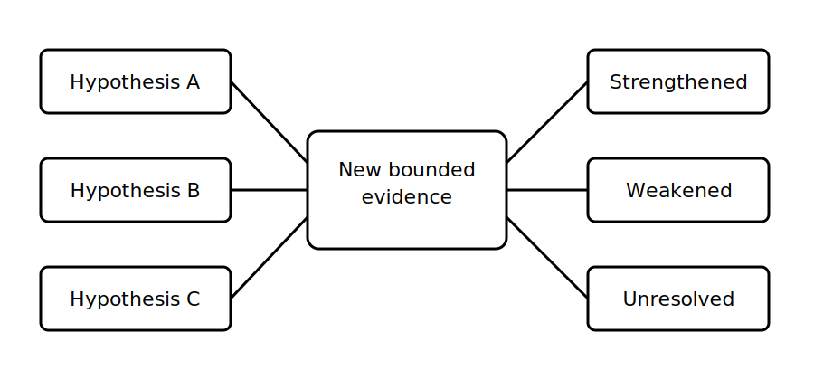

# Fault Diagnosis as Evidence Updating

## 1. Outcome and entry check
By the end, the learner can maintain several plausible explanations for a fictional fault, update their relative support when new evidence arrives, and select a bounded next evidence question without jumping to a repair conclusion.

**Entry check:** Explain why the first plausible explanation for a symptom should be treated as a hypothesis rather than a diagnosis.

## 2. Why it matters
Fault diagnosis is not a contest to guess the cause quickly. It is a disciplined process of reducing uncertainty. Each observation should strengthen, weaken or leave unchanged the support for competing explanations. This prevents confirmation bias, unnecessary intervention and unsafe escalation from incomplete evidence.

## 3. Core concepts and terminology
- **Symptom:** an observed condition or reported effect requiring explanation.
- **Hypothesis:** a provisional explanation that could account for the symptom.
- **Prior support:** the initial plausibility assigned from available context, not a numerical probability.
- **Evidence update:** a recorded change in support after relevant evidence is added.
- **Disconfirming evidence:** evidence that conflicts with a hypothesis or makes it less plausible.
- **Discriminating question:** a question or authorised evidence step that separates competing hypotheses.
- **Residual uncertainty:** uncertainty that remains after the current evidence has been considered.

## 4. Rule-finding workflow
1. Define the symptom, scope, installation state and evidence limitations.
2. Separate reported information from directly observed evidence.
3. Generate at least two plausible hypotheses where the evidence permits.
4. Record what each hypothesis would and would not predict.
5. Locate current authorised criteria for any technical interpretation.
6. Compare each new evidence item with every active hypothesis.
7. Mark support as strengthened, weakened, unchanged or unresolved, with a reason.
8. Choose the least-assumptive authorised discriminating question, or stop and escalate when safety, competence or evidence validity is uncertain.

## 5. Visual model or worked example

**Worked example:** A fictional load is reported as intermittently unavailable. The learner keeps three explanations open: supply-state change, control-path interruption and load-side condition. A source-state record weakens the first explanation but does not prove either remaining cause. The next question is chosen for its ability to distinguish the remaining hypotheses, not because it confirms the preferred one.

## 6. Practical application
For three fictional symptoms, create an evidence-update table with: initial evidence, two or more hypotheses, predicted patterns, one new evidence card, update direction, residual uncertainty and next discriminating question.

Assessment evidence: multiple plausible hypotheses, explicit predictions, updates applied across all hypotheses, use of disconfirming evidence, bounded next questions and no unsupported repair or compliance conclusion.

## 7. Common errors and safety checkpoint
Common errors include anchoring on the first explanation, collecting only confirming evidence, treating absence of evidence as proof, changing a hypothesis without recording why, using labels as conclusive evidence and proposing intervention before the safety state is established.

**Safety checkpoint:** This module teaches evidence reasoning only. It does not prescribe fault-finding procedures, energised work, instruments, test methods, values, access steps or repairs. Technical interpretation and field action require current authorised sources, approved procedures, suitable equipment and competent supervision.

## 8. Retrieval and next links
Define hypothesis, evidence update, disconfirming evidence and residual uncertainty. Explain why every new evidence item must be compared with all active hypotheses.

- Previous: [Block 42 — Rest, Reflection and Catch-Up](block-42-rest-reflection-and-catch-up.md)
- Next: [Block 44 — Symptom, Cause and Test Distinction](block-44-symptom-cause-and-test-distinction.md)
- Knowledge note: [Fault Diagnosis as Evidence Updating](../../../knowledge-base/9-week/Block 43 - Fault Diagnosis as Evidence Updating.md)