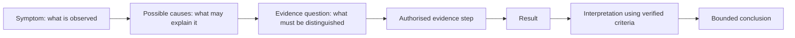
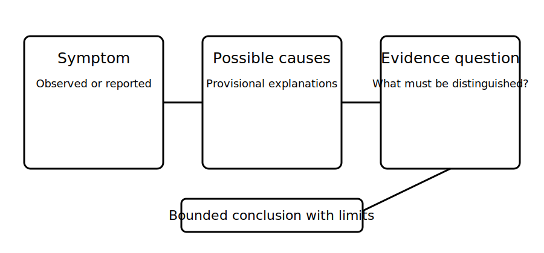

# Symptom, Cause and Test Distinction

## 1. Outcome and entry check
By the end, the learner can classify statements as symptom, possible cause, evidence question or conclusion, and rewrite mixed or overclaimed statements into traceable diagnostic language.

**Entry check:** Classify this statement: “The device trips because the cable is damaged.” Identify which parts are observation and which are inference.

## 2. Why it matters
Diagnostic records become unreliable when observations, explanations and evidence steps are blended together. A symptom describes what is known. A possible cause explains what might account for it. A test or evidence question states what information could distinguish alternatives. Keeping these categories separate makes reasoning auditable and reduces premature conclusions.

## 3. Core concepts and terminology
- **Symptom statement:** a neutral description of an observed or reported condition.
- **Possible cause:** a provisional mechanism that may explain one or more symptoms.
- **Evidence question:** the specific uncertainty the next evidence step is intended to reduce.
- **Test purpose:** the property or relationship an authorised test is intended to provide evidence about.
- **Result:** the recorded output of an observation or authorised test, including limitations.
- **Interpretation:** the meaning assigned to a result using verified criteria and context.
- **Conclusion:** the bounded claim supported by the current evidence, with residual uncertainty stated.

## 4. Rule-finding workflow
1. Copy the original statement without editing it.
2. Underline directly observed or reported facts.
3. Circle inferred mechanisms, causes or compliance claims.
4. Rewrite the symptom in neutral language with scope and source.
5. List possible causes separately and avoid ranking them without evidence.
6. State the evidence question before naming a test or action.
7. Verify any technical test purpose, sequence, criterion or limitation against current authorised sources.
8. Record result, interpretation and conclusion as separate fields; stop when the required action is unsafe, unauthorised or beyond competence.

## 5. Visual model or worked example

**Worked example:** “The protective device is faulty” is rewritten as: reported symptom—supply to the load is lost after a recurring event; possible causes—several mechanisms remain open; evidence question—which evidence would distinguish a load condition, circuit condition and device condition? No test method or replacement is selected from the symptom alone.

## 6. Practical application
Sort 18 fictional statement cards into symptom, possible cause, evidence question, result, interpretation or conclusion. Rewrite six mixed statements so each category is explicit and linked to its evidence source.

Assessment evidence: neutral symptom wording, causes framed provisionally, evidence questions that distinguish alternatives, test purpose separated from method, results separated from interpretation and conclusions limited to supported scope.

## 7. Common errors and safety checkpoint
Common errors include naming a cause as though observed, calling an intervention a test, selecting a test before defining its purpose, treating a single result as a diagnosis, omitting evidence limitations and using compliance language without verified criteria.

**Safety checkpoint:** This module does not supply test procedures, energised diagnostic steps, instruments, values, access instructions or repair decisions. Any field evidence step must be authorised, risk-controlled and performed within competence using current procedures.

## 8. Retrieval and next links
From memory, define symptom, possible cause, evidence question, result, interpretation and conclusion. Rewrite one causal claim as a neutral symptom plus two hypotheses.

- Previous: [Block 43 — Fault Diagnosis as Evidence Updating](block-43-fault-diagnosis-as-evidence-updating.md)
- Next: [Block 45 — Safe Diagnostic Boundaries](block-45-safe-diagnostic-boundaries.md)
- Knowledge note: [Symptom, Cause and Test Distinction](../../../knowledge-base/9-week/Block 44 - Symptom Cause and Test Distinction.md)