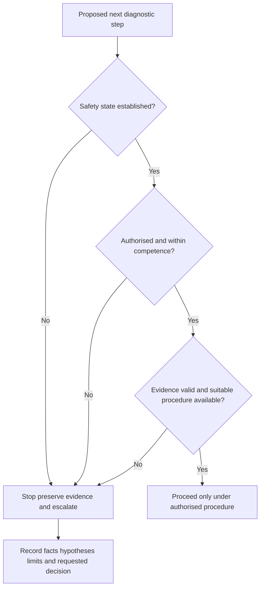
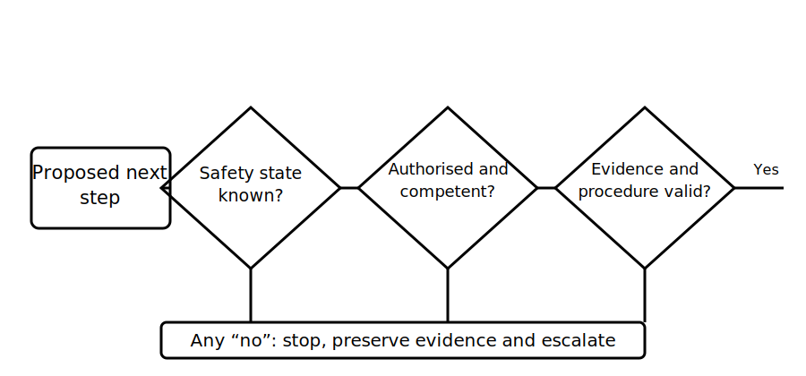

# Safe Diagnostic Boundaries

## 1. Outcome and entry check
By the end, the learner can identify when a fictional diagnostic task must stop, state the unresolved condition clearly, preserve the evidence already obtained and formulate an appropriate escalation request without inventing a field procedure.

**Entry check:** Name three uncertainties that should stop diagnostic progression even when a likely cause appears obvious.

## 2. Why it matters
Diagnostic momentum can encourage unsafe continuation. A technically plausible next step is not automatically authorised, safe or within competence. Clear stop gates protect people, evidence and equipment while ensuring the unresolved question is handed over in a form another competent person can act on.

## 3. Core concepts and terminology
- **Diagnostic boundary:** the limit of the current task, authority, competence, access or safe state.
- **Stop gate:** a condition that prevents progression until resolved through an authorised process.
- **Safety-state uncertainty:** lack of reliable evidence about energisation, stored energy, alternate supplies or other hazards.
- **Evidence-validity concern:** reason to doubt that existing evidence represents the claimed scope or state.
- **Competence boundary:** the point beyond which knowledge, authorisation or supervision is insufficient.
- **Preservation action:** a non-invasive step that records and protects evidence without changing the installation state.
- **Escalation brief:** a concise statement of scope, evidence, uncertainty, hazard and requested decision.

## 4. Rule-finding workflow
1. Restate the diagnostic question and current scope.
2. Confirm what is known about source state, stored energy, access and task authorisation.
3. Identify whether the proposed next step changes state, exposes hazards, disturbs evidence or requires specialised competence.
4. Check current authorised procedures for required controls and responsibility boundaries.
5. Stop if safety state, authority, competence, equipment suitability, evidence validity or procedure is uncertain.
6. Preserve neutral records of observations, timestamps, configuration and limitations without invasive action.
7. Write an escalation brief separating facts, hypotheses, unresolved questions and potential hazards.
8. Resume only when the responsible authorised process has resolved the stop gate.

## 5. Visual model or worked example

**Worked example:** A fictional evidence pack suggests an alternate source may still affect the stated scope, but its operating state is not established. The learner stops, records the conflicting source information, preserves the current configuration record and requests authorised source-state confirmation. They do not propose an isolation sequence or test method.

## 6. Practical application
Review eight fictional diagnostic decision cards. For each, choose proceed-under-authorised-procedure, seek clarification or stop-and-escalate. Cite the boundary involved and write a five-line escalation brief for every stop decision.

Assessment evidence: correct identification of stop gates, separation of hazard from hypothesis, evidence preservation, concise escalation requests, no invented procedure and no claim that escalation resolves the technical issue.

## 7. Common errors and safety checkpoint
Common errors include continuing because the likely cause seems simple, treating supervision as implied, assuming a labelled control establishes a safe state, disturbing evidence before recording it, escalating without stating the unresolved decision and describing unauthorised steps in excessive procedural detail.

**Safety checkpoint:** This module deliberately stops before operational instruction. It does not teach isolation, proving, energised diagnosis, access, dismantling, testing, instrument selection or repair. Exact responsibilities and procedures require current authorised sources and competent workplace control.

## 8. Retrieval and next links
List six stop-gate categories and state the minimum contents of an escalation brief. Explain why a likely diagnosis does not remove a safety or competence boundary.

- Previous: [Block 44 — Symptom, Cause and Test Distinction](block-44-symptom-cause-and-test-distinction.md)
- Next: [Block 46 — Documentation and Traceability](block-46-documentation-and-traceability.md)
- Knowledge note: [Safe Diagnostic Boundaries](../../../knowledge-base/9-week/Block 45 - Safe Diagnostic Boundaries.md)