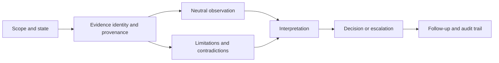
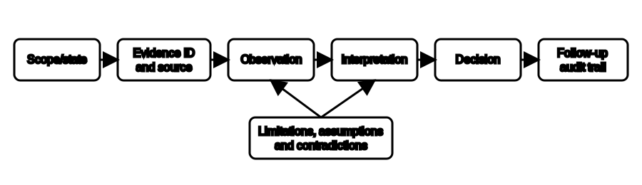

# Documentation and Traceability

## 1. Outcome and entry check
By the end, the learner can build a traceable fictional diagnostic record that links scope, source, observation, interpretation, uncertainty, decision and follow-up without turning assumptions into facts.

**Entry check:** What information would another competent reviewer need to reconstruct how a conclusion was reached?

## 2. Why it matters
A technically plausible conclusion is weak when its evidence cannot be located, its operating state is unclear or its interpretation has overwritten the original observation. Traceability allows review, correction and handover while preserving the difference between what was observed and what was inferred.

## 3. Core concepts and terminology
- **Record identity:** the unique label, date, version or location used to retrieve an item.
- **Provenance:** where evidence came from and who or what produced it.
- **Scope statement:** the equipment, area, state and question covered by the record.
- **Observation:** a neutral account of what the evidence shows.
- **Interpretation:** a reasoned meaning assigned to an observation.
- **Decision link:** the connection between evidence, reasoning and an action or escalation.
- **Audit trail:** a sequence showing additions, corrections and decisions without concealing earlier states.
- **Traceability gap:** missing information that prevents a reviewer from following the reasoning chain.

## 4. Rule-finding workflow
1. Define the fictional task scope, operating state and documentation purpose.
2. Check current authorised requirements for record fields, retention, responsibility and approved systems.
3. Assign each evidence item an identity and provenance statement.
4. Record observations before adding interpretation.
5. Link each interpretation to the evidence items that support or contradict it.
6. Record assumptions, limitations and unresolved questions explicitly.
7. Link each decision or escalation to its evidence basis and responsible next step.
8. Preserve corrections through an audit trail rather than silently replacing material facts.

## 5. Visual model or worked example

**Worked example:** A fictional inspection image and a separate test summary concern the same circuit but were captured in different stated operating conditions. The learner records both identities and states, avoids combining them as one observation, and marks the unresolved state mismatch before any conclusion.

## 6. Practical application
Convert a disorganised fictional case folder into a one-page traceability register. Include evidence ID, provenance, scope, state, neutral observation, interpretation, confidence, contradiction, decision link and follow-up owner. Add two deliberate traceability gaps and explain why each prevents a stronger conclusion.

Assessment evidence: complete reconstruction path, observations separated from interpretations, identifiable sources and states, visible contradictions, bounded conclusions and no invented compliance status.

## 7. Common errors and safety checkpoint
Common errors include copying conclusions into observation fields, omitting operating state, merging records from different scopes, treating filenames as sufficient provenance, deleting superseded reasoning, assigning certainty without supporting evidence and documenting unauthorised procedures as completed.

**Safety checkpoint:** Documentation does not establish that equipment is safe, compliant or suitable for service. Required records, responsibilities and retention rules must be checked against current authorised sources and workplace systems. Do not fabricate measurements, signatures, approvals or completed controls.

## 8. Retrieval and next links
From memory, draw the seven-link traceability chain. Then explain how a scope mismatch, state mismatch and missing provenance each weaken a conclusion differently.

- Previous: [Block 45 — Safe Diagnostic Boundaries](block-45-safe-diagnostic-boundaries.md)
- Next: [Block 47 — Defect Communication Without Overclaiming](block-47-defect-communication-without-overclaiming.md)
- Knowledge note: [Documentation and Traceability](../../../knowledge-base/9-week/Block 46 - Documentation and Traceability.md)
