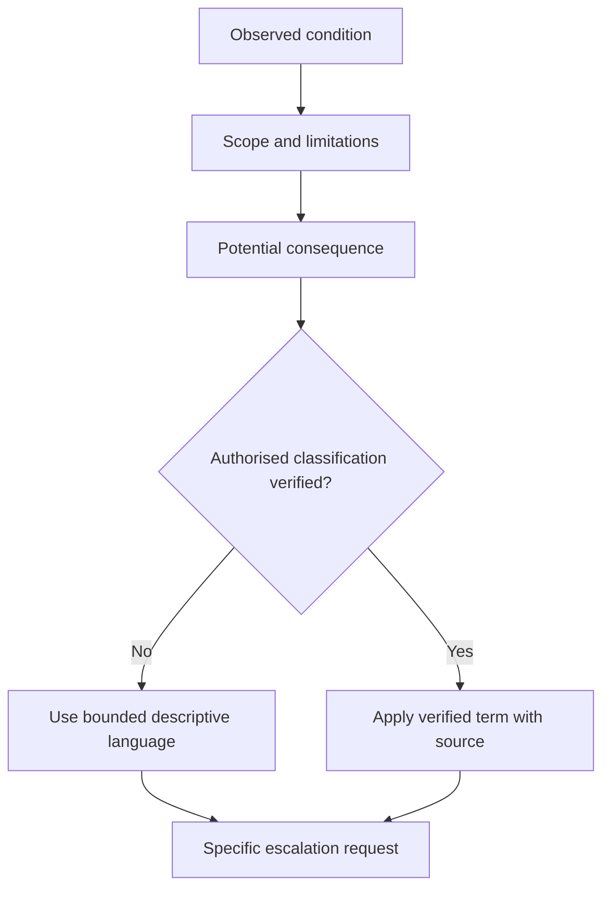
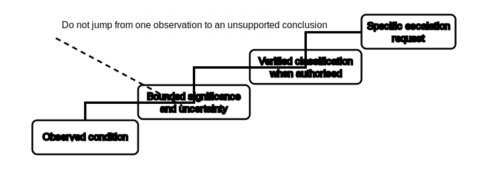

# Defect Communication Without Overclaiming

## 1. Outcome and entry check
By the end, the learner can write a concise fictional defect communication that distinguishes observed condition, potential consequence, uncertainty, required escalation and authorised classification.

**Entry check:** Rewrite “the circuit is dangerous and non-compliant” as a bounded statement when only one contradictory observation is available.

## 2. Why it matters
Defect communication must prompt appropriate attention without presenting an unverified cause, category or compliance decision as settled fact. Overclaiming can distort priorities; under-communication can hide material uncertainty. A disciplined message states what is known, why it matters and what decision is still required.

## 3. Core concepts and terminology
- **Observed condition:** the neutral evidence available within the stated scope and state.
- **Potential consequence:** a credible outcome expressed without claiming it has occurred.
- **Defect hypothesis:** a possible explanation that remains subject to evidence and authorised review.
- **Classification:** a category assigned under an authorised framework, not invented from memory.
- **Urgency signal:** a bounded reason for timely attention based on evidence and uncertainty.
- **Qualification:** wording that states scope, confidence and limitations.
- **Escalation request:** the specific decision, review or control sought from an authorised person.

## 4. Rule-finding workflow
1. State the affected fictional scope and evidence date or state.
2. Describe the observed condition in neutral language.
3. Separate any possible cause from the observation.
4. State the potential consequence conditionally and proportionately.
5. Identify contradictions, missing evidence and confidence limits.
6. Check current authorised sources before using a formal defect category, priority or compliance term.
7. Request the specific authorised review, decision or control required.
8. Re-read the message and remove unsupported certainty, blame and procedural instruction.

## 5. Visual model or worked example

**Worked example:** A fictional label conflicts with the documented supply arrangement. The learner reports the conflict and the possibility of incorrect source identification, states that source state and formal classification remain unverified, and requests authorised review. They do not declare the installation non-compliant or prescribe corrective work.

## 6. Practical application
Given six fictional evidence snippets, draft a three-part message for each: observed condition, bounded significance and requested next decision. Mark every word that would require authorised-source support. Then rank the drafts by communication quality rather than by invented defect severity.

Assessment evidence: neutral observations, conditional consequence language, explicit uncertainty, verified-versus-unverified terminology, actionable escalation and no unsupported category or remedy.

## 7. Common errors and safety checkpoint
Common errors include using “safe,” “unsafe,” “compliant,” “failed” or formal categories without a verified basis; implying causation from correlation; omitting the affected scope; hiding contradictory evidence; prescribing repair; and using vague escalation such as “please investigate” without naming the needed decision.

**Safety checkpoint:** This module does not assign real defect classifications, response times, access controls or remedial procedures. Formal terms and urgency rules require current authorised sources, workplace processes and qualified judgement. When immediate risk is suspected, follow the applicable authorised escalation process rather than this educational wording exercise.

## 8. Retrieval and next links
State the difference between observation, defect hypothesis, potential consequence and formal classification. Draft one bounded escalation sentence from memory.

- Previous: [Block 46 — Documentation and Traceability](block-46-documentation-and-traceability.md)
- Next: [Block 48 — Cumulative Diagnostic Case](block-48-cumulative-diagnostic-case.md)
- Knowledge note: [Defect Communication Without Overclaiming](../../../knowledge-base/9-week/Block 47 - Defect Communication Without Overclaiming.md)
