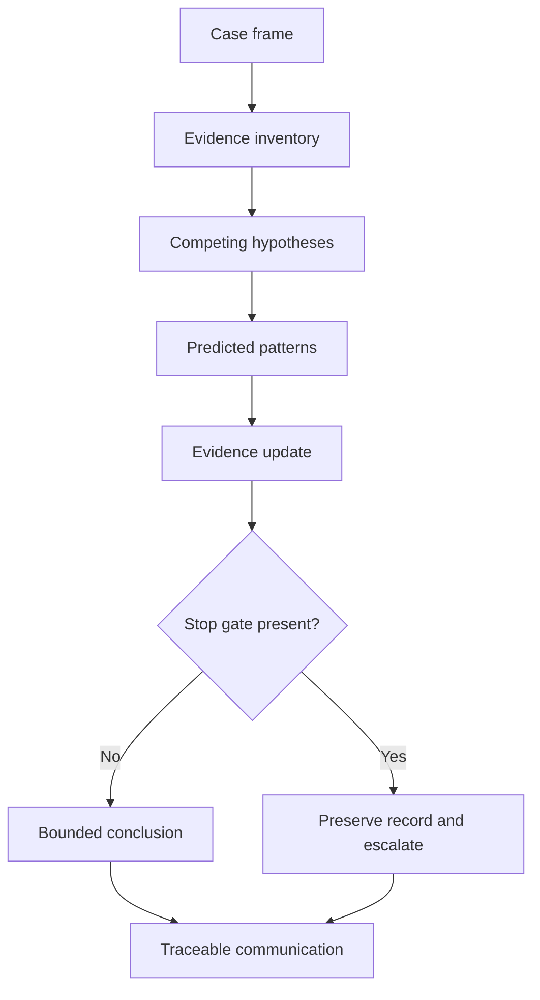
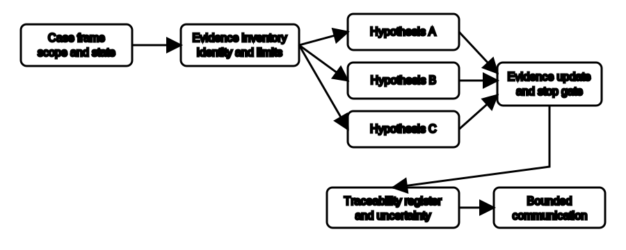

# Cumulative Diagnostic Case

## 1. Outcome and entry check
By the end, the learner can analyse a fictional diagnostic evidence pack, maintain competing hypotheses, identify stop gates, construct a traceable record and communicate a bounded escalation without proposing field procedures.

**Entry check:** List the minimum evidence columns needed to keep symptom, cause, evidence question, result, interpretation and decision separate.

## 2. Why it matters
Diagnostic quality depends on more than selecting a likely cause. A defensible response preserves alternatives, notices contradictions, respects safety and competence boundaries, and allows another reviewer to reconstruct the reasoning. This case integrates those habits under a realistic but non-operational constraint.

## 3. Core concepts and terminology
- **Case frame:** the fictional scope, state, symptom and decision requested.
- **Hypothesis set:** multiple plausible explanations retained until evidence distinguishes them.
- **Predicted pattern:** evidence expected if a hypothesis is true.
- **Discriminating evidence:** information that meaningfully separates competing hypotheses.
- **Stop gate:** a boundary that blocks further progression.
- **Traceability register:** the linked record of evidence identity, observation, interpretation and decision.
- **Bounded communication:** a message that states evidence, significance, uncertainty and escalation without overclaiming.
- **Residual uncertainty:** material doubt remaining after the available evidence is analysed.

## 4. Rule-finding workflow
1. Frame the fictional symptom, scope, operating states and requested decision.
2. Inventory evidence and record identity, provenance, state and limitations.
3. Generate at least three plausible hypotheses, including one non-fault explanation.
4. Predict a distinct evidence pattern for each hypothesis.
5. Update support using available confirming, disconfirming and contradictory evidence.
6. Apply safety, authority, competence and evidence-validity stop gates.
7. Build a traceability register linking each bounded conclusion to evidence and uncertainty.
8. Draft a defect communication requesting exactly the authorised decision still needed.

## 5. Visual model or worked example

**Worked example:** A fictional circuit is reported as intermittently unavailable. Records include a user description, a switching-state note, an image with uncertain date and a summary result that may concern a different scope. The learner keeps control-state, supply-state, connection and record-mismatch hypotheses open, identifies the scope mismatch as a stop gate and requests authorised evidence reconciliation.

## 6. Practical application
Complete a 35-minute paper case containing twelve fictional evidence items, two contradictions and one irrelevant distractor. Produce: a case frame, evidence register, three-hypothesis table, update log, stop-gate decision, five-line escalation and a reflection naming the single most consequential assumption.

Assessment evidence: complete evidence inventory, distinct predictions, balanced updating, contradiction handling, correct stop decision, traceable conclusions, bounded communication and no operational diagnostic instruction.

## 7. Common errors and safety checkpoint
Common errors include anchoring on the first plausible cause, treating missing evidence as negative evidence, merging different operating states, ignoring provenance, continuing past a stop gate, assigning a formal defect category, suggesting tests or repairs, and writing a conclusion that cannot be traced back to specific evidence.

**Safety checkpoint:** The case is documentary and fictional. It does not authorise access, isolation, energised work, testing, instrument use, dismantling or repair. Exact diagnostic procedures, defect categories and response controls require current authorised sources and qualified workplace review.

## 8. Retrieval and next links
Without notes, reproduce the eight-step case workflow and identify where a symptom, hypothesis, stop gate, traceability gap and escalation request belong.

- Previous: [Block 47 — Defect Communication Without Overclaiming](block-47-defect-communication-without-overclaiming.md)
- Next: [Block 49 — Rest, Reflection and Catch-Up](block-49-rest-reflection-and-catch-up.md)
- Knowledge note: [Cumulative Diagnostic Case](../../../knowledge-base/9-week/Block 48 - Cumulative Diagnostic Case.md)
