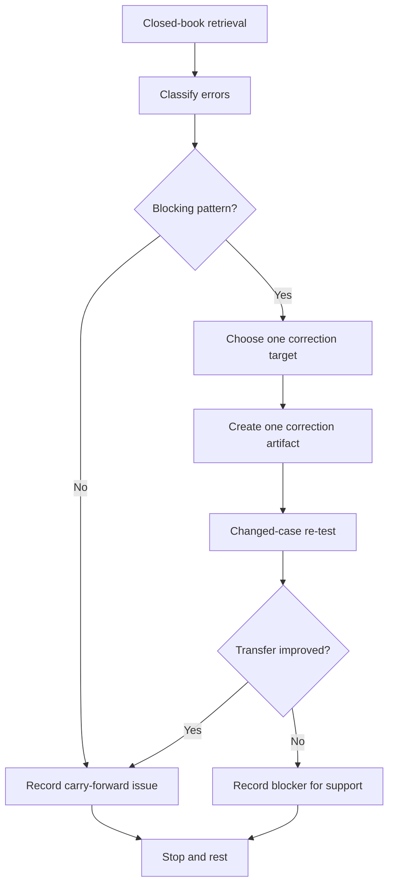
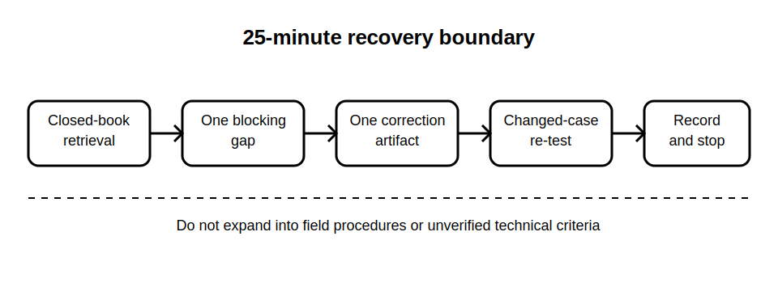

# Rest, Reflection and Catch-Up

## 1. Outcome and entry check
By the end, the learner can diagnose one blocking Week 7 reasoning gap, complete one bounded repair, demonstrate transfer on a changed documentary case and stop within the recovery boundary.

**Entry check:** Without notes, write one sentence each defining symptom, hypothesis, evidence question, stop gate, traceability and bounded communication. Mark the first definition that becomes vague or merges two ideas.

## 2. Why it matters
Fault-diagnosis learning becomes unsafe when confidence grows faster than evidence discipline. A recovery block slows the pace, exposes fragile distinctions and repairs one dependency before the capstone integration week begins.

## 3. Core concepts and terminology
- **Blocking gap:** a missing distinction that prevents defensible reasoning.
- **Error pattern:** a repeated mistake rather than a single slip.
- **Correction artifact:** one compact diagram, table or rewritten evidence chain.
- **Changed-case re-test:** a new fictional case used to test transfer.
- **Recovery boundary:** a fixed time and scope limit.
- **Carry-forward issue:** an unresolved item recorded for qualified or authorised review.

## 4. Rule-finding workflow
1. Set a 25-minute limit.
2. Complete a six-minute closed-book retrieval across Blocks 43–48.
3. Classify errors as blocking, non-blocking or reference-dependent.
4. Select exactly one blocking error pattern.
5. Review only the relevant module section; do not broaden into field procedures.
6. Produce one correction artifact.
7. Re-test with a changed documentary case.
8. Record the result, one carry-forward issue and stop.

## 5. Visual model or worked example

**Worked example:** A learner repeatedly writes a likely cause as though it were an observation. They rebuild one row separating observed symptom, hypothesis and evidence question, then classify a changed fictional record. Any question requiring a real test method is logged rather than answered from memory.

## 6. Practical application
Use six prompt cards: hypothesis update, symptom-cause separation, stop gates, traceability, bounded defect language and cumulative case reasoning. Rate each secure, fragile or blocked. Repair one blocked item and re-test it with a changed case.

Assessment evidence: accurate self-diagnosis, one bounded repair, improved transfer, one explicit carry-forward issue and compliance with the stop rule.

## 7. Common errors and safety checkpoint
Common errors include rereading all six modules, repairing several gaps, choosing an easy item, treating confidence as evidence, inventing a diagnostic procedure, reusing the same example and extending the session beyond the boundary.

**Safety checkpoint:** This is a reasoning recovery block only. It does not authorise access, isolation, energised work, testing, dismantling, repair or removal of any earlier review flag.

## 8. Retrieval and next links
State the one-gap recovery cycle from memory and explain why the changed-case re-test provides stronger evidence than immediate repetition.

- Previous: [Block 48 — Cumulative Diagnostic Case](block-48-cumulative-diagnostic-case.md)
- Next: [Block 50 — Integrated Installation Scenario Setup](block-50-integrated-installation-scenario-setup.md)
- Knowledge note: [Rest, Reflection and Catch-Up](../../../knowledge-base/9-week/Block 49 - Rest Reflection and Catch-Up.md)
