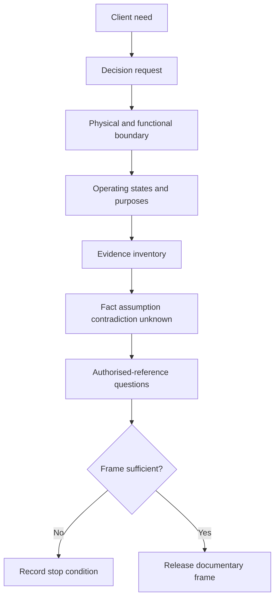
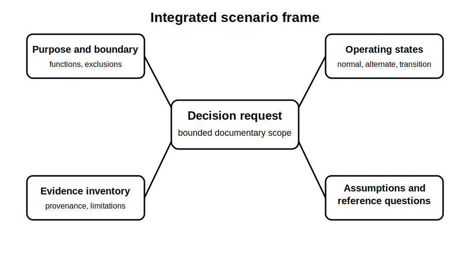

# Integrated Installation Scenario Setup

## 1. Outcome and entry check
By the end, the learner can convert a fictional installation brief into a bounded scenario frame containing scope, purposes, operating states, evidence sources, assumptions, exclusions and unresolved authorised-reference questions.

**Entry check:** Name four reasons an apparently detailed installation brief may still be unsafe or insufficient for design, verification or diagnosis conclusions.

## 2. Why it matters
Capstone work fails early when learners begin calculating or judging compliance before defining the decision, installation boundary and evidence state. A disciplined setup makes later planning, protection, switching, inspection and diagnostic work traceable without pretending that fictional evidence authorises field action.

## 3. Core concepts and terminology
- **Scenario frame:** the documented boundary within which reasoning is permitted.
- **Installation purpose:** the functions and continuity needs the fictional installation must support.
- **Operating state:** a defined combination of sources, controls, loads and conditions.
- **Evidence inventory:** records supplied, their provenance and limitations.
- **Assumption register:** explicit provisional statements requiring confirmation.
- **Exclusion:** a matter outside the scenario or learner authority.
- **Decision request:** the precise output the evidence pack must support.
- **Reference question:** a technical requirement that must be checked in a current authorised source.

## 4. Rule-finding workflow
1. State the fictional client need and requested decision.
2. Draw the physical, functional and documentary boundaries.
3. List installation purposes, critical functions and foreseeable operating states.
4. Inventory sources, loads, control points and stored-energy possibilities at concept level.
5. Catalogue supplied evidence with provenance and limitations.
6. Separate confirmed facts, assumptions, contradictions and unknowns.
7. Create an authorised-reference question list for every clause, value, method or acceptance criterion needed later.
8. Apply stop conditions and approve only a documentary scenario frame for the next block.

## 5. Visual model or worked example

**Worked example:** A fictional community facility brief mentions grid supply, backup generation, essential refrigeration and future solar. The learner records normal, backup and transition states; identifies missing source-control and documentation evidence; and frames questions for authorised requirements without selecting equipment or declaring compliance.

## 6. Practical application
Given a two-page fictional brief and eight mixed-quality records, produce a one-page scenario frame containing: decision request, boundary sketch, purpose list, operating-state table, evidence inventory, assumption register, contradiction log, exclusions, stop conditions and five prioritised reference questions.

Assessment evidence: complete boundary, observable distinctions between fact and assumption, relevant operating states, evidence provenance, bounded questions and no unsupported technical conclusion.

## 7. Common errors and safety checkpoint
Common errors include treating the brief as verified fact, omitting transition states, assuming labels prove source control, hiding assumptions inside prose, using a missing record as evidence of absence, choosing technical values from memory and letting the scenario imply authority for field work.

**Safety checkpoint:** This module creates a fictional documentary frame only. It does not authorise design, access, switching, isolation, inspection, testing, energised work, equipment selection or compliance certification. Exact requirements remain subject to current authorised sources and qualified review.

## 8. Retrieval and next links
Without notes, reproduce the eight setup steps and explain how a reference question differs from an assumption.

- Previous: [Block 49 — Rest, Reflection and Catch-Up](block-49-rest-reflection-and-catch-up.md)
- Next: [Block 51 — Planning Evidence Pack](block-51-planning-evidence-pack.md)
- Knowledge note: [Integrated Installation Scenario Setup](../../../knowledge-base/9-week/Block 50 - Integrated Installation Scenario Setup.md)
