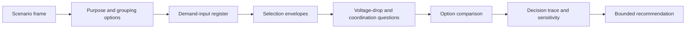
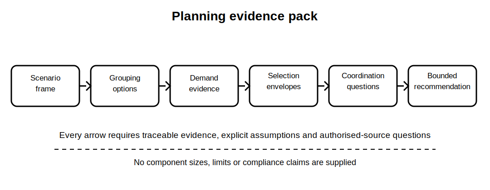

# Planning Evidence Pack

## 1. Outcome and entry check
By the end, the learner can build a traceable planning evidence pack for the fictional integrated scenario, linking purpose, circuit division, demand assumptions, selection variables, coordination questions and unresolved authorised-source checks without producing a compliant design.

**Entry check:** From memory, list the evidence categories needed before a conductor or protective-device choice could be justified.

## 2. Why it matters
A planning answer is not defensible because its final diagram looks plausible. It must show how each decision follows from the scenario, what evidence supports it, which assumptions remain provisional and where authorised requirements must be checked.

## 3. Core concepts and terminology
- **Planning evidence pack:** the connected set of records supporting a provisional planning recommendation.
- **Purpose statement:** the function and continuity consequence assigned to a circuit or group.
- **Demand basis:** the documented inputs, method and assumptions used to assess loading.
- **Selection envelope:** the interacting variables constraining a component choice.
- **Coordination question:** a required relationship between load, conductor, protection and equipment still to be verified.
- **Decision trace:** a link from scenario evidence through reasoning to a bounded recommendation.
- **Sensitivity check:** a comparison showing which assumption materially changes the outcome.
- **Open technical item:** a requirement awaiting current authorised-source or qualified review.

## 4. Rule-finding workflow
1. Import the approved scenario frame and decision request from Block 50.
2. Convert installation purposes and continuity consequences into provisional circuit-grouping options.
3. Build a demand-input register and identify the authorised method still required.
4. Create a selection-envelope table for each provisional circuit group.
5. Record voltage-drop and coordination questions without inserting unverified limits or values.
6. Compare at least two planning options against function, common-mode loss, evidence completeness and uncertainty.
7. Build a decision trace and sensitivity check for the preferred provisional option.
8. Issue a bounded planning recommendation with open technical items and stop conditions.

## 5. Visual model or worked example

**Worked example:** For the fictional community facility, the learner compares one broad essential-services group with two separated groups. They document continuity consequences, uncertain load data, route and environment questions, and the need for authorised demand, voltage-drop and coordination criteria. The output recommends only which option should proceed to technical review.

## 6. Practical application
Create a six-part planning pack: purpose-and-grouping matrix, demand-input register, selection-envelope table, open coordination questions, two-option comparison and decision trace. Add a one-paragraph recommendation naming three assumptions and three technical checks that prevent final design approval.

Assessment evidence: traceable use of the Block 50 frame, observable option comparison, explicit assumptions, complete variable categories, sensitivity reasoning, bounded language and no invented technical values.

## 7. Common errors and safety checkpoint
Common errors include jumping directly to component sizes, disguising assumptions as inputs, using generic diversity from memory, treating voltage drop as the only selection constraint, collapsing overload and fault coordination, comparing only one option and presenting a provisional recommendation as a compliant design.

**Safety checkpoint:** This educational pack does not constitute design, certification or installation instruction. Exact clauses, demand methods, correction factors, ratings, limits, device characteristics and compliant combinations require current authorised sources and qualified technical review.

## 8. Retrieval and next links
Without notes, reproduce the eight-step planning-pack workflow and identify the three places where authorised criteria are most likely to be required.

- Previous: [Block 50 — Integrated Installation Scenario Setup](block-50-integrated-installation-scenario-setup.md)
- Next: [Block 52 — Protection and Earthing Review](block-52-protection-and-earthing-review.md)
- Knowledge note: [Planning Evidence Pack](../../../knowledge-base/9-week/Block 51 - Planning Evidence Pack.md)
