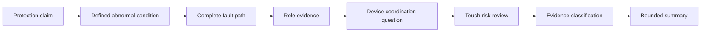
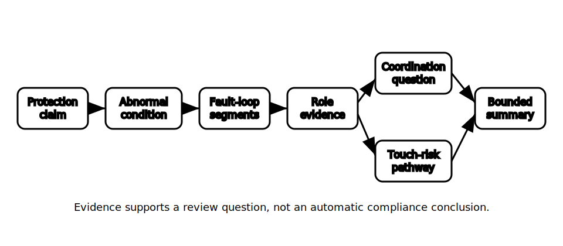

# Protection and Earthing Review

## 1. Outcome and entry check
By the end, the learner can review the fictional capstone evidence pack for protection-and-earthing completeness, distinguish demonstrated relationships from assumptions, and produce a bounded list of technical-review questions.

**Entry check:** Without notes, sketch a fault-current loop and label the roles of exposed conductive parts, protective earthing, the source return path and the protective device.

## 2. Why it matters
Protection and earthing arguments often look convincing while hiding an incomplete path, an assumed conductor role or an unverified device relationship. A review must test the reasoning chain rather than reward familiar terminology.

## 3. Core concepts and terminology
- **Protection claim:** a proposed statement about how risk would be limited under a defined abnormal condition.
- **Earthing role:** the intended protective function assigned to a conductor, connection or conductive part.
- **Fault-loop completeness:** whether every segment from fault origin back to the source is identified.
- **Coordination dependency:** an unresolved relationship among load, conductor, device, equipment and fault conditions.
- **Touch-risk pathway:** a possible route involving simultaneous contact with points at different potentials.
- **Evidence gap:** information required before a claim can be justified.
- **Boundary statement:** wording that limits a conclusion to the evidence actually available.

## 4. Rule-finding workflow
1. Extract every protection and earthing claim from the planning pack.
2. Link each claim to the abnormal condition it is intended to address.
3. Trace the proposed current path from fault origin back to the source.
4. Check conductor and conductive-part roles against evidence, not colour or labels alone.
5. Identify the protective-device relationship that still requires authorised criteria.
6. Map possible touch-risk pathways and unresolved exposure assumptions.
7. Classify each claim as supported, provisional, contradicted or not assessable.
8. Produce a technical-review question list and bounded summary.

## 5. Visual model or worked example

**Worked example:** In the fictional community facility, a proposed essential-services circuit is described as protected by an earthing path and an upstream device. The learner identifies the claimed fault origin, traces the assumed return path, flags an undocumented bonding relationship and records that device performance cannot be concluded without authorised criteria and qualified review.

## 6. Practical application
Review the Block 51 planning pack and create a seven-column table: claim, abnormal condition, path segments, role evidence, unresolved coordination criterion, touch-risk question and review status. Finish with three priority questions for a qualified reviewer.

Assessment evidence: complete path tracing, observable distinction between evidence and assumption, correct use of bounded statuses, identification of contradictions, and no invented clauses, values or compliant combinations.

## 7. Common errors and safety checkpoint
Common errors include treating earth and neutral as interchangeable, assuming a labelled conductor proves continuity or function, omitting the source return path, claiming device operation from topology alone, ignoring alternative supplies and converting a planning hypothesis into a compliance conclusion.

**Safety checkpoint:** This review is documentary only. It does not authorise access, isolation, testing, energised work, alterations or commissioning. Exact arrangements, clauses, fault criteria, device characteristics, limits and verification requirements need current authorised sources and qualified technical review.

## 8. Retrieval and next links
Without notes, reproduce the eight-step review and explain why a complete drawn path still does not prove protective performance.

- Previous: [Block 51 — Planning Evidence Pack](block-51-planning-evidence-pack.md)
- Next: [Block 53 — Switching and Alternate-Supply Review](block-53-switching-and-alternate-supply-review.md)
- Knowledge note: [Protection and Earthing Review](../../../knowledge-base/9-week/Block 52 - Protection and Earthing Review.md)
