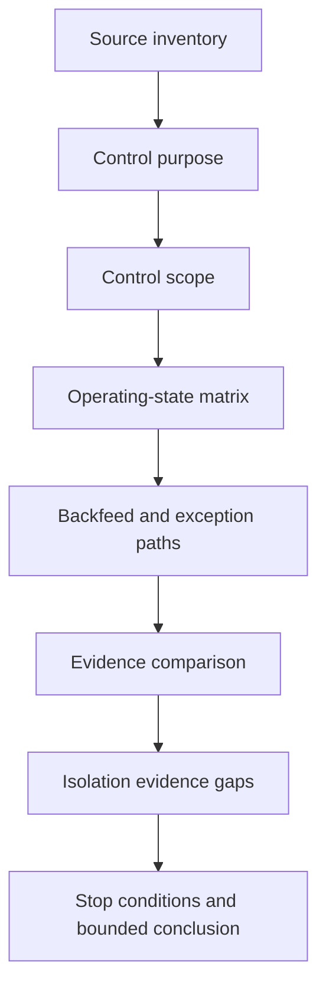
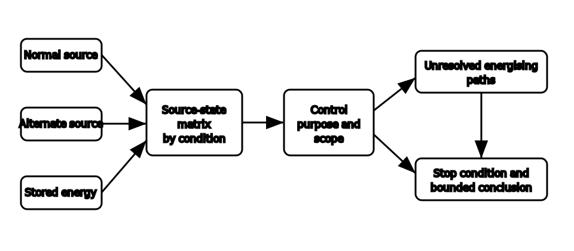

# Switching and Alternate-Supply Review

## 1. Outcome and entry check
By the end, the learner can review the fictional capstone scenario for switching purpose, control scope, source states and alternate energising paths, then identify evidence gaps and stop conditions without prescribing an isolation procedure.

**Entry check:** From memory, state the difference between functional switching and isolation, then list every category of source that may need consideration.

## 2. Why it matters
A control can stop equipment without isolating every energising path. Alternate, auxiliary and stored-energy sources make label-based reasoning especially unreliable. Review must therefore cover purpose, scope, state and evidence.

## 3. Core concepts and terminology
- **Control purpose:** the intended function of a switching action.
- **Control scope:** the equipment, circuit or source paths actually affected.
- **Source state:** the confirmed, excluded, possible or unknown contribution of a source in a defined operating condition.
- **Transition state:** the interval in which source or control relationships are changing.
- **Alternate energising path:** any path capable of supplying energy outside the assumed normal route.
- **Isolation evidence:** information supporting a conclusion about separation from relevant energy sources.
- **Stop condition:** a gap or contradiction that prevents a safe documentary conclusion.

## 4. Rule-finding workflow
1. Inventory normal, alternate, auxiliary and stored-energy sources.
2. List each control point and its claimed purpose.
3. Map the physical and functional scope claimed for each control.
4. Build source-state rows for normal, alternate and transition conditions.
5. Identify possible backfeed, bypass and exception paths.
6. Compare labels, diagrams and scenario statements for contradictions.
7. Mark the evidence required before any isolation claim could be reviewed.
8. Record stop conditions and issue a bounded documentary conclusion.

## 5. Visual model or worked example

**Worked example:** The fictional facility has a normal supply, an alternate source and equipment with stored energy. A labelled main control appears to stop normal operation, but the scenario does not prove its scope over the alternate path or stored energy. The learner records the unresolved paths and stops before making an isolation claim.

## 6. Practical application
Create a source-control matrix for the Block 50 scenario with rows for each source and columns for normal, alternate, transition and shutdown states. Add claimed control scope, contradictory evidence, unresolved energising paths and documentary stop conditions.

Assessment evidence: complete source inventory, purpose-versus-isolation distinction, state-specific reasoning, explicit alternate paths, contradiction handling and no invented switching sequence.

## 7. Common errors and safety checkpoint
Common errors include treating off as isolated, assuming one main switch controls all sources, ignoring stored energy, considering only stable states, relying on labels as proof, overlooking backfeed paths and turning a documentary review into field instructions.

**Safety checkpoint:** This module does not prescribe switching, isolation, proving, discharge, access or energised-work procedures. Exact control requirements, sequences, interlocks, verification methods and source arrangements require current authorised sources, approved procedures and qualified review.

## 8. Retrieval and next links
Without notes, reproduce the eight-step source-control review and name three reasons that an off indication may be insufficient evidence of isolation.

- Previous: [Block 52 — Protection and Earthing Review](block-52-protection-and-earthing-review.md)
- Next: [Block 54 — Inspection and Testing Review](block-54-inspection-and-testing-review.md)
- Knowledge note: [Switching and Alternate-Supply Review](../../../knowledge-base/9-week/Block 53 - Switching and Alternate-Supply Review.md)
