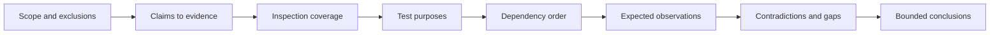
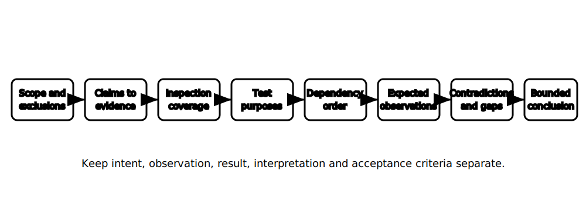

# Inspection and Testing Review

## 1. Outcome and entry check
By the end, the learner can review the fictional capstone verification plan for scope, inspection coverage, test purposes, dependencies, expected observations, contradictions and conclusion limits without prescribing field procedures.

**Entry check:** Without notes, list the evidence layers that must remain distinct from design intent through to a verification conclusion.

## 2. Why it matters
Verification becomes unreliable when observations, results, interpretations and acceptance decisions are collapsed into one statement. A review must test whether the evidence plan is complete, ordered by dependency and capable of revealing contradictions.

## 3. Core concepts and terminology
- **Verification scope:** the defined installation, systems, states and exclusions covered by the evidence plan.
- **Inspection coverage:** the locations and attributes intended to be observed.
- **Test purpose:** the property or relationship a proposed test is intended to investigate.
- **Prerequisite:** an evidence or safety condition required before a later activity can be considered.
- **Expected observation:** a documented prediction derived from the design hypothesis.
- **Contradiction:** evidence inconsistent with an expectation, record or other evidence item.
- **Conclusion boundary:** the limit beyond which the available evidence does not support a claim.

## 4. Rule-finding workflow
1. Restate verification scope, exclusions and relevant operating states.
2. Map each design claim to required inspection or test evidence.
3. Check inspection coverage using the structured visual lenses.
4. State each proposed test purpose without specifying a procedure.
5. Arrange evidence activities by prerequisites and evidence-preservation needs.
6. Record expected observations before reviewing fictional results.
7. Triage contradictions, coverage gaps and invalid evidence.
8. Draft bounded conclusions and authorised-source review questions.

## 5. Visual model or worked example

**Worked example:** The fictional facility plan claims that a circuit grouping and protective arrangement are suitable. The learner links each claim to documentary inspection and test purposes, identifies a missing prerequisite for one proposed evidence item, records a contradiction between a label and a diagram, and refuses to make a final acceptance decision.

## 6. Practical application
Create a verification-review matrix for the capstone scenario with columns for claim, scope, inspection evidence, test purpose, prerequisite, expected observation, contradiction response and conclusion boundary. Identify two coverage gaps and two questions requiring authorised criteria.

Assessment evidence: traceable claim-to-evidence links, clear observation-result-interpretation separation, dependency reasoning, contradiction handling, and no invented test procedure, order, value or acceptance limit.

## 7. Common errors and safety checkpoint
Common errors include treating inspection as proof of hidden conditions, listing tests without purposes, assuming a universal order, recording expectations after seeing results, dismissing contradictions as noise, accepting evidence with unknown validity and making a compliance decision from incomplete coverage.

**Safety checkpoint:** This is a documentary review only. It does not prescribe inspection access, isolation, energised testing, instruments, proving methods, test sequences, values or acceptance criteria. Current authorised sources, approved procedures and qualified technical review remain mandatory.

## 8. Retrieval and next links
Without notes, reproduce the eight-step verification review and explain how pre-recorded expectations improve contradiction detection.

- Previous: [Block 53 — Switching and Alternate-Supply Review](block-53-switching-and-alternate-supply-review.md)
- Next: [Block 55 — Timed Cumulative Integration](block-55-timed-cumulative-integration.md)
- Knowledge note: [Inspection and Testing Review](../../../knowledge-base/9-week/Block 54 - Inspection and Testing Review.md)
