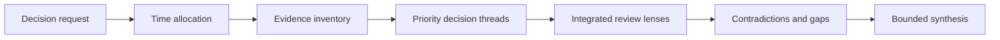
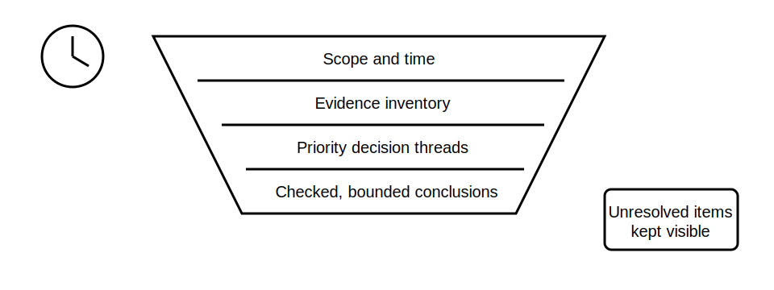

# Timed Cumulative Integration

## 1. Outcome and entry check
By the end, the learner can produce a bounded, traceable response to a fictional integrated installation brief within a fixed study window, prioritising evidence quality over unsupported completeness.

**Entry check:** Without notes, list the five evidence packs developed in Blocks 50–54 and one unresolved question from each.

## 2. Why it matters
Time pressure exposes weak sequencing, hidden assumptions and overclaiming. A disciplined response first secures scope, evidence and safety boundaries, then develops only conclusions that the available record supports.

## 3. Core concepts and terminology
- **Time box:** a fixed period that limits work and forces prioritisation.
- **Evidence anchor:** a cited item supporting a statement.
- **Decision thread:** the chain from question through evidence and reasoning to a bounded conclusion.
- **Coverage gap:** a required area not supported by available evidence.
- **Confidence label:** a stated level such as supported, provisional or unresolved.
- **Stop rule:** a condition requiring the learner to stop inference and record what must be verified.

## 4. Rule-finding workflow
1. Read the decision request and mark scope, exclusions and operating states.
2. Allocate the time box across orientation, analysis, checking and final synthesis.
3. Build an evidence inventory before drafting conclusions.
4. Select the highest-consequence decision threads.
5. Link each claim to evidence, assumptions and authorised-reference questions.
6. Apply protection, earthing, switching, supply and verification review lenses.
7. Mark contradictions, coverage gaps, confidence and stop rules.
8. Submit a concise response with unresolved items separated from supported findings.

## 5. Visual model or worked example

**Worked example:** In a 45-minute fictional case, the learner spends five minutes defining scope, ten building the evidence inventory, twenty analysing three high-consequence threads and ten checking traceability. A tempting fourth conclusion is left unresolved because its criterion has not been verified.

## 6. Practical application
Complete the capstone scenario under a 45-minute study time box. Produce: scope statement; evidence inventory; three decision threads; contradiction log; confidence labels; two authorised-source questions; and a 150-word bounded synthesis.

Assessment evidence: disciplined prioritisation, traceable reasoning, explicit uncertainty, correct use of stop rules and no invented clause, value, procedure or compliance outcome.

## 7. Common errors and safety checkpoint
Common errors include drafting before inventorying evidence, treating speed as permission to guess, spending equal time on low- and high-consequence details, hiding unresolved criteria, and converting a documentary exercise into field instructions.

**Safety checkpoint:** This timed activity is documentary and fictional. It does not authorise access, isolation, switching, testing, energised work, instrument use, design approval or certification. Current authorised sources and qualified review remain mandatory.

## 8. Retrieval and next links
Without notes, reproduce the eight-step workflow and explain why an unresolved conclusion can be stronger than a complete-looking unsupported answer.

- Previous: [Block 54 — Inspection and Testing Review](block-54-inspection-and-testing-review.md)
- Next: [Block 56 — Rest, Reflection and Catch-Up](block-56-rest-reflection-and-catch-up.md)
- Knowledge note: [Timed Cumulative Integration](../../../knowledge-base/9-week/Block 55 - Timed Cumulative Integration.md)