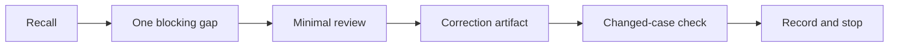
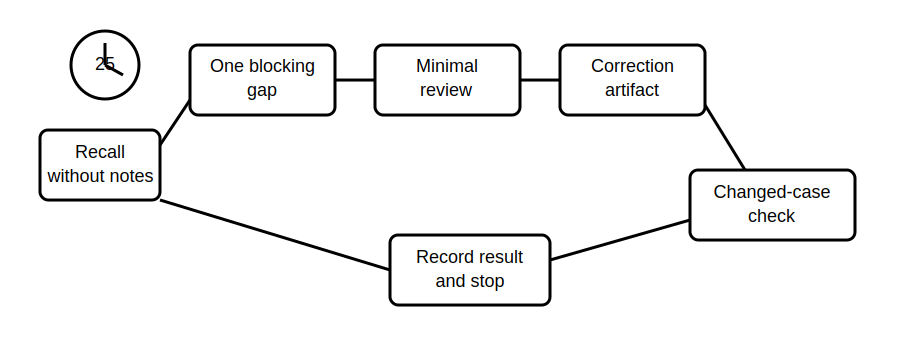

# Rest, Reflection and Catch-Up

## 1. Outcome and entry check
By the end, the learner can diagnose one limiting performance pattern from the timed integration, complete one targeted correction and stop without expanding the session into another full assessment.

**Entry check:** From memory, name the point in Block 55 where your response became least traceable or most rushed.

## 2. Why it matters
Consolidation is not passive delay. A bounded recovery block converts one observed error into a corrected retrieval cue while preserving rest before mock assessment.

## 3. Core concepts and terminology
- **Performance pattern:** a repeatable way reasoning weakens under load.
- **Blocking gap:** the single issue most likely to impair the next task.
- **Correction artifact:** a small reusable aid created from the error.
- **Changed-case check:** a brief application using different surface details.
- **Stopping boundary:** the predetermined point at which study ends.

## 4. Rule-finding workflow
1. Reconstruct the timed workflow without notes.
2. Identify one blocking gap from the submitted evidence.
3. Classify it as recall, sequencing, evidence, scope, safety or time allocation.
4. Reopen only the minimum source material needed.
5. Create one correction artifact.
6. Test it on one changed fictional prompt.
7. Record whether the error recurred and one cue for next time.
8. Stop at 25 minutes and defer all non-blocking gaps.

## 5. Visual model or worked example

**Worked example:** The learner notices that conclusions were drafted before evidence anchors. They create a three-column claim-evidence-boundary card, use it on a new short scenario, record improved traceability and stop at 25 minutes.

## 6. Practical application
Review Block 55 and complete a one-page recovery record: blocking gap, category, evidence of the problem, correction artifact, changed-case result, next-task cue and deferred items.

Assessment evidence: one specific diagnosed pattern, a proportionate correction, successful or honestly unsuccessful re-test, and adherence to the stopping boundary.

## 7. Common errors and safety checkpoint
Common errors include correcting every weakness, rereading without retrieval, choosing an easy non-blocking issue, repeating the original case unchanged and treating rest as failure.

**Safety checkpoint:** Do not use this block to resolve technical criteria from memory. Preserve every `reference_check_required` item for authorised-source verification and qualified review.

## 8. Retrieval and next links
Without notes, state the six error categories and explain why one corrected blocking gap is preferable to broad untested rereading.

- Previous: [Block 55 — Timed Cumulative Integration](block-55-timed-cumulative-integration.md)
- Next: [Block 57 — Mock Assessment Briefing and Calibration](block-57-mock-assessment-briefing-and-calibration.md)
- Knowledge note: [Rest, Reflection and Catch-Up](../../../knowledge-base/9-week/Block 56 - Rest, Reflection and Catch-Up.md)