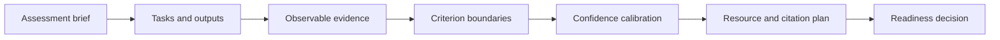
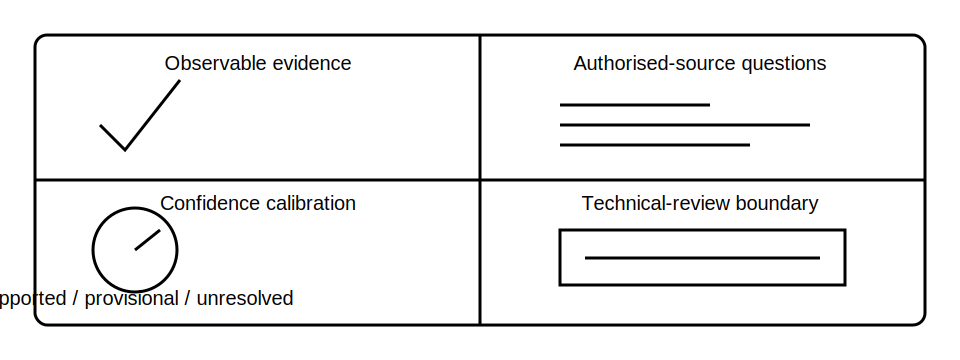

# Mock Assessment Briefing and Calibration

## 1. Outcome and entry check
By the end, the learner can interpret the fictional mock-assessment brief, distinguish assessed behaviours from technical approval, calibrate confidence and prepare a lawful evidence-use plan.

**Entry check:** Without notes, state three behaviours the program can assess and three technical judgments it cannot authorise.

## 2. Why it matters
A mock assessment is useful only when the learner understands what the evidence can demonstrate. Clear calibration prevents false confidence, criterion invention and confusion between educational performance and qualified technical competence.

## 3. Core concepts and terminology
- **Assessment construct:** the capability the exercise is designed to sample.
- **Observable evidence:** work product or behaviour that can be evaluated directly.
- **Calibration:** alignment between confidence and evidential support.
- **Criterion boundary:** the limit of what the exercise claims to judge.
- **Permitted resource:** a source explicitly allowed for the exercise.
- **Technical-review boundary:** the point beyond which qualified review and current authorised sources are required.

## 4. Rule-finding workflow
1. Parse the fictional brief into tasks, outputs, time limits and resource rules.
2. Translate each task into observable evidence.
3. Separate reasoning quality from unverified technical correctness.
4. Mark every criterion needing an authorised source or qualified reviewer.
5. Define confidence labels and when each may be used.
6. Plan evidence citation, assumption logging and stop-rule use.
7. Complete a short calibration sample and score only observable behaviours.
8. Record readiness, residual gaps and the boundary of any claim.

## 5. Visual model or worked example

**Worked example:** A learner can be credited for locating the relevant authorised source category, stating an assumption and refusing to invent a value. The exercise cannot certify that the learner selected the legally correct clause, procedure or installation outcome.

## 6. Practical application
Create a mock-assessment readiness sheet with: task-output map; permitted resources; observable evidence; confidence labels; citation method; stop rules; five `reference_check_required` items; and a 10-minute calibration response to a fictional mini-brief.

Assessment evidence: accurate brief parsing, observable objectives, realistic confidence, traceable resource use and explicit separation between educational feedback and technical approval.

## 7. Common errors and safety checkpoint
Common errors include treating a mock score as competence certification, inventing official marking rules, hiding permitted-resource use, confusing fluent writing with supported reasoning and using confidence language without evidence.

**Safety checkpoint:** This program does not reproduce or claim an official RTO assessment, licence assessment or authorised technical review. Exact criteria, clauses, procedures and safety-critical judgments require current authorised sources and qualified oversight.

## 8. Retrieval and next links
Without notes, reproduce the eight-step briefing workflow and explain the difference between observable reasoning performance and technical approval.

- Previous: [Block 56 — Rest, Reflection and Catch-Up](block-56-rest-reflection-and-catch-up.md)
- Next: [Block 58 — Mock Assessment Part A: Rule Finding](block-58-mock-assessment-part-a-rule-finding.md)
- Knowledge note: [Mock Assessment Briefing and Calibration](../../../knowledge-base/9-week/Block 57 - Mock Assessment Briefing and Calibration.md)