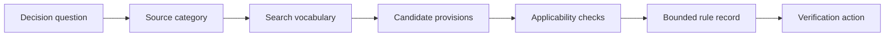
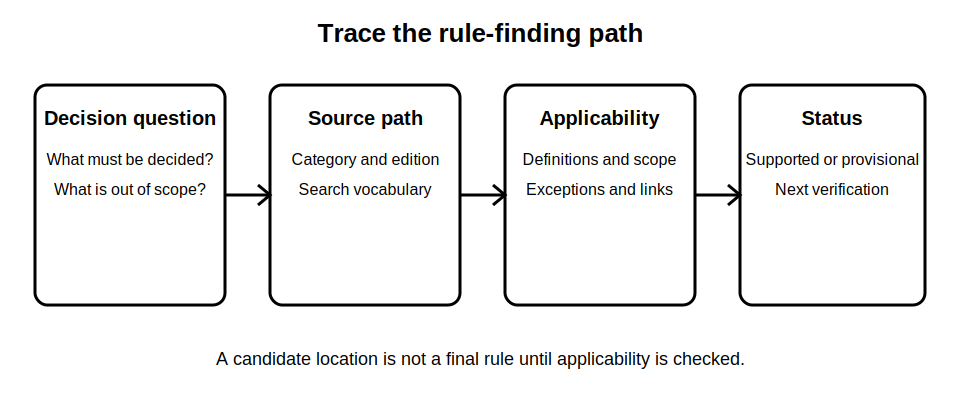

# Mock Assessment Part A - Rule Finding

## 1. Outcome and entry check
By the end, the learner can convert a fictional technical question into a traceable rule-finding record that identifies the decision, source hierarchy, search terms, candidate provisions, applicability checks and unresolved reference questions.

**Entry check:** Without notes, write the six fields needed to show how a rule was located without claiming that the selected provision is technically correct.

## 2. Why it matters
Rule finding is assessable only when the path from question to source is visible. A plausible answer without provenance, scope checks or uncertainty labels is weaker than a bounded answer that shows exactly what still requires authorised verification.

## 3. Core concepts and terminology
- **Decision question:** the precise issue the source must help resolve.
- **Source hierarchy:** the ordered set of authorised source categories relevant to the jurisdiction and task.
- **Search vocabulary:** controlled terms, synonyms and system concepts used to locate candidates.
- **Candidate provision:** a potentially relevant passage not yet accepted as applicable.
- **Applicability check:** confirmation of scope, definitions, exceptions, cross-references and current edition.
- **Rule record:** a traceable note linking question, source, location, interpretation boundary and status.

## 4. Rule-finding workflow
1. Restate the fictional prompt as one decision question.
2. Identify the authorised source category before searching.
3. Generate technical terms, synonyms and related concepts.
4. Search headings, definitions, index terms and cross-references.
5. Record candidate provisions without copying systematic wording.
6. Test scope, definitions, exceptions, edition and jurisdiction.
7. Mark the result as supported, provisional or `reference_check_required`.
8. Write a bounded answer and an explicit next verification action.

## 5. Visual model or worked example

**Worked example:** For a fictional question about whether a control point serves a stated purpose, the learner identifies the relevant source category, searches purpose and scope terms, records two candidate locations and explains why neither can be accepted until definitions and exceptions are checked.

## 6. Practical application
Complete a 30-minute closed-resource-first mock. Produce three rule records, each containing the decision question, source category, search vocabulary, candidate location, applicability checks, confidence label, copyright-safe paraphrase and next verification action.

Assessment evidence: disciplined source selection, efficient search vocabulary, explicit applicability checks, traceable uncertainty and refusal to invent clauses or values.

## 7. Common errors and safety checkpoint
Common errors include searching before defining the question, treating search results as authority, copying extensive wording, ignoring definitions or exceptions, using an outdated edition and presenting a candidate provision as a final rule.

**Safety checkpoint:** No clause number, prescribed value, procedure or compliance conclusion is accepted from memory. This mock assesses rule-finding behaviour only; technical correctness requires current authorised sources and qualified review.

## 8. Retrieval and next links
Without notes, reproduce the eight-step workflow and explain why a candidate provision is not yet an applicable rule.

- Previous: [Block 57 — Mock Assessment Briefing and Calibration](block-57-mock-assessment-briefing-and-calibration.md)
- Next: [Block 59 — Mock Assessment Part B: Application](block-59-mock-assessment-part-b-application.md)
- Knowledge note: [Mock Assessment Part A - Rule Finding](../../../knowledge-base/9-week/Block 58 - Mock Assessment Part A - Rule Finding.md)
