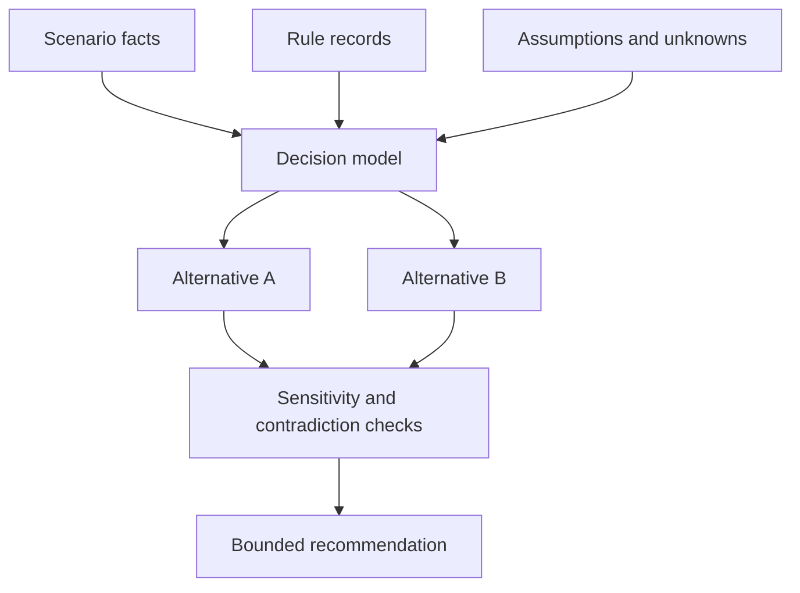
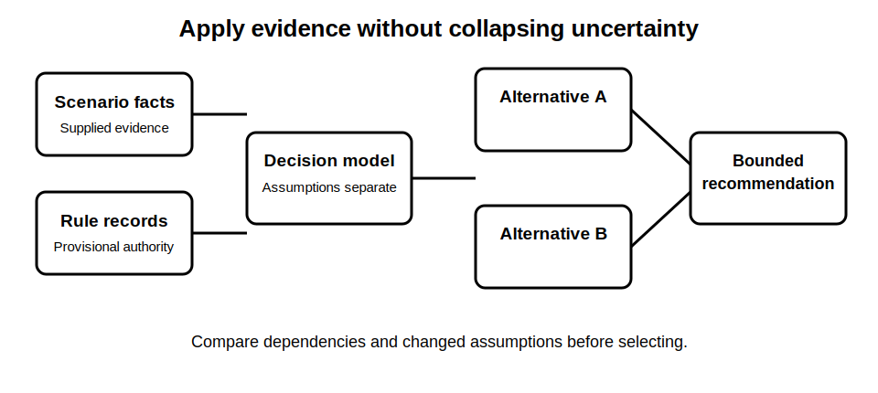

# Mock Assessment Part B - Application

## 1. Outcome and entry check
By the end, the learner can apply provisional rule records to a fictional installation scenario, compare alternatives, expose assumptions and produce a bounded recommendation without presenting it as a compliant design.

**Entry check:** State the difference between a source-backed rule record, a scenario fact, an assumption and a technical conclusion.

## 2. Why it matters
Application fails when learners jump directly from a general rule to a confident answer. Strong work shows how facts, assumptions, dependencies and contradictions affect the result and where qualified review is still required.

## 3. Core concepts and terminology
- **Scenario fact:** information explicitly supplied by the fictional brief.
- **Assumption:** a necessary but unverified input.
- **Decision dependency:** a fact or rule that could change the recommendation.
- **Alternative:** a materially different response to the same decision question.
- **Sensitivity check:** testing whether a conclusion changes when an uncertain input changes.
- **Bounded recommendation:** an educational conclusion limited by stated evidence and review conditions.

## 4. Rule-finding workflow
1. Restate the decision and list supplied facts.
2. Attach each relevant provisional rule record.
3. Separate facts, assumptions and unknowns.
4. Generate at least two plausible alternatives.
5. Trace dependencies and likely consequences for each.
6. Test contradictions and one changed assumption.
7. Select the best-supported provisional option.
8. State limitations, stop conditions and required review.

## 5. Visual model or worked example

**Worked example:** Given a fictional installation with incomplete source-state information, the learner compares two planning responses, shows how an unknown alternate supply affects both and declines to recommend field action until that dependency is resolved.

## 6. Practical application
Complete a 35-minute fictional case. Submit a fact-assumption-unknown table, two rule-record links, two alternatives, a dependency map, one sensitivity check, one contradiction response and a bounded recommendation with review conditions.

Assessment evidence: correct evidence separation, explicit dependencies, comparison rather than intuition, uncertainty-sensitive reasoning and disciplined conclusion language.

## 7. Common errors and safety checkpoint
Common errors include converting assumptions into facts, selecting one option too early, overlooking alternate sources, using an unverified value, treating absence of evidence as evidence of absence and writing a compliance claim.

**Safety checkpoint:** The case is documentary and fictional. It does not authorise design, switching, isolation, inspection, testing or field work. Safety-critical conclusions remain `reference_check_required` and require qualified review.

## 8. Retrieval and next links
Without notes, explain how facts, assumptions, rules and dependencies combine to support—but limit—a recommendation.

- Previous: [Block 58 — Mock Assessment Part A: Rule Finding](block-58-mock-assessment-part-a-rule-finding.md)
- Next: [Block 60 — Mock Assessment Part C: Visual Evidence](block-60-mock-assessment-part-c-visual-evidence.md)
- Knowledge note: [Mock Assessment Part B - Application](../../../knowledge-base/9-week/Block 59 - Mock Assessment Part B - Application.md)
