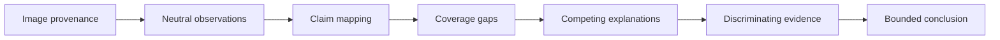
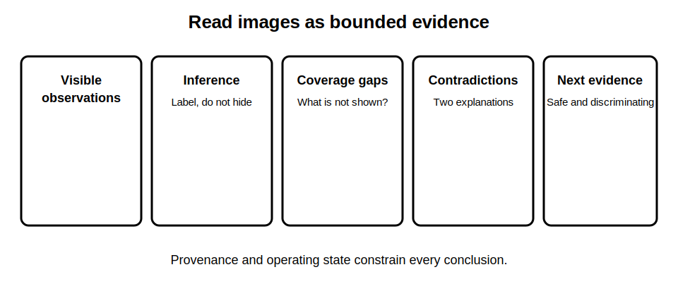

# Mock Assessment Part C - Visual Evidence

## 1. Outcome and entry check
By the end, the learner can interpret a fictional visual evidence pack, distinguish observation from inference, map each image to a decision question and communicate contradictions, coverage gaps and next evidence needs.

**Entry check:** Describe one visible observation and two different inferences that could be drawn from it.

## 2. Why it matters
Images can create false certainty because they feel concrete while hiding scope, sequence, scale and context. Reliable visual reasoning records what is actually visible, what is not shown and what further evidence would discriminate between explanations.

## 3. Core concepts and terminology
- **Observation:** a neutral description of visible content.
- **Inference:** an interpretation that extends beyond what is directly visible.
- **Coverage:** the part of the installation, state or time represented.
- **Provenance:** where, when and under what conditions the image was captured.
- **Contradiction:** visual evidence inconsistent with another claim or record.
- **Discriminating evidence:** additional evidence capable of separating plausible explanations.

## 4. Rule-finding workflow
1. Confirm the decision question and image provenance.
2. Inventory each image, view and stated operating condition.
3. Record neutral observations before interpretation.
4. Map observations to the claims they support or challenge.
5. Identify blind spots, missing views and uncertain scale.
6. Generate at least two explanations for each contradiction.
7. Specify the safest discriminating evidence request.
8. Write a bounded visual-evidence conclusion.

## 5. Visual model or worked example

**Worked example:** A fictional photograph shows a labelled control and adjacent conductors. The learner records the visible label and routing, but does not infer control scope, conductor function or de-energised state without corroborating evidence.

## 6. Practical application
Complete a 30-minute fictional image-pack review. Produce an image inventory, twelve neutral observations, six inference labels, three coverage gaps, two contradictions with competing explanations and three bounded requests for discriminating evidence.

Assessment evidence: observation-inference separation, provenance awareness, claim mapping, contradiction handling, accessible annotation and restraint in conclusions.

## 7. Common errors and safety checkpoint
Common errors include identifying equipment or conductor roles from appearance alone, assuming an image shows the whole system, ignoring capture state, treating labels as proof, using inaccessible annotations and requesting unsafe evidence collection.

**Safety checkpoint:** Images do not establish safe state, isolation, compliance or permission to access equipment. Any field inspection, testing or additional image capture must follow authorised procedures and qualified supervision.

## 8. Retrieval and next links
Without notes, reproduce the eight-step visual-evidence workflow and explain why a photograph cannot establish isolation.

- Previous: [Block 59 — Mock Assessment Part B: Application](block-59-mock-assessment-part-b-application.md)
- Next: [Block 61 — Error Analysis and Targeted Remediation](block-61-error-analysis-and-targeted-remediation.md)
- Knowledge note: [Mock Assessment Part C - Visual Evidence](../../../knowledge-base/9-week/Block 60 - Mock Assessment Part C - Visual Evidence.md)
