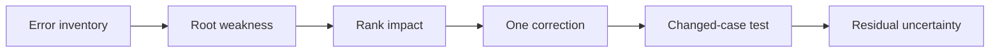
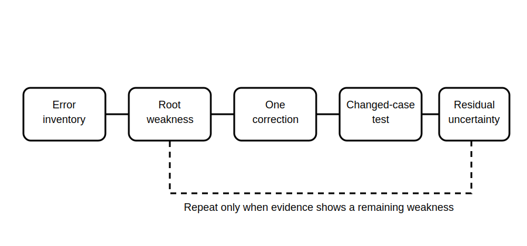

# Error Analysis and Targeted Remediation

## 1. Outcome and entry check
By the end, the learner can classify errors from the mock assessment, select the highest-leverage underlying weakness, design one focused correction and demonstrate transfer on a changed fictional case.

**Entry check:** Distinguish an error symptom from its likely underlying cause.

## 2. Why it matters
Repeating a whole assessment after every mistake is inefficient. Effective remediation identifies the smallest reusable skill that failed, corrects it and tests transfer beyond the original question.

## 3. Core concepts and terminology
- **Error symptom:** the visible failure in an answer.
- **Root weakness:** the reusable skill that produced the symptom.
- **Error class:** retrieval, applicability, evidence handling, boundary control or communication.
- **Correction artifact:** a compact checklist, distinction table or decision prompt.
- **Transfer test:** a changed case requiring the same skill.
- **Residual uncertainty:** what remains unresolved after correction.

## 4. Rule-finding workflow
1. Inventory errors without rewriting the answers.
2. Separate symptoms from root weaknesses.
3. Group repeated weaknesses into error classes.
4. Rank them by consequence, frequency and downstream impact.
5. Select exactly one highest-leverage weakness.
6. Create one concise correction artifact.
7. Apply it to a changed fictional case.
8. Record the result and residual uncertainty.

## 5. Visual model or worked example

**Worked example:** A learner finds a plausible rule category but does not test applicability. The correction is an applicability gate covering scope, condition and exceptions.

## 6. Practical application
Review outputs from Blocks 58–60. Classify at least six errors, select one root weakness, build one correction artifact and apply it to two changed prompts. Explain what improved and what remains unresolved.

Assessment evidence: accurate classification, prioritisation, focused correction, transfer and bounded self-evaluation.

## 7. Common errors and safety checkpoint
Common errors include correcting wording only, choosing several targets, retesting the same question and claiming mastery after one successful retry.

**Safety checkpoint:** Remediation does not validate technical content. Unresolved clauses, values, procedures or formal classifications still require current authorised sources and qualified review.

## 8. Retrieval and next links
Without notes, reproduce the eight-step workflow and explain why a changed-case test is stronger than repeating the same question.

- Previous: [Block 60 — Mock Assessment Part C: Visual Evidence](block-60-mock-assessment-part-c-visual-evidence.md)
- Next: [Block 62 — Final Cumulative Retrieval](block-62-final-cumulative-retrieval.md)
- Knowledge note: [Error Analysis and Targeted Remediation](../../../knowledge-base/9-week/Block 61 - Error Analysis and Targeted Remediation.md)