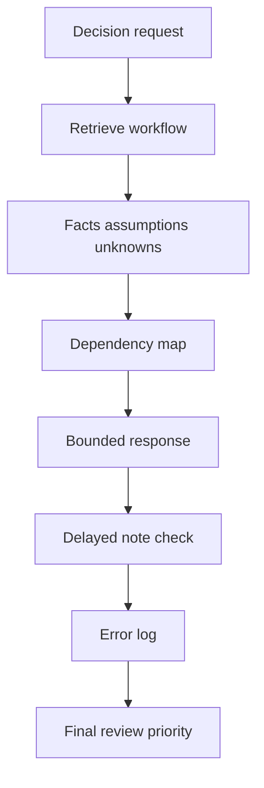
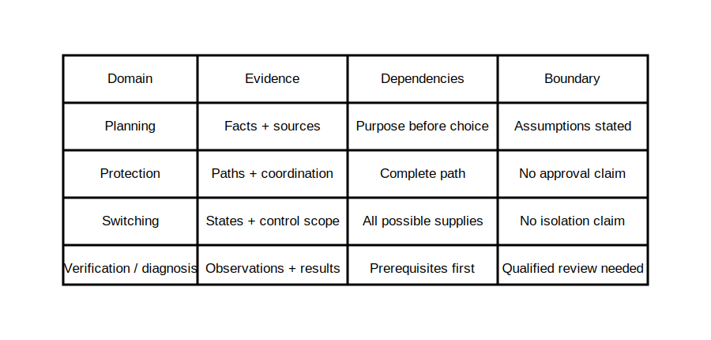

# Final Cumulative Retrieval

## 1. Outcome and entry check
By the end, the learner can retrieve and connect the program's core reasoning workflows without notes, identify weak links and produce bounded answers across a mixed fictional case.

**Entry check:** From memory, list four distinct evidence habits used across the program.

## 2. Why it matters
Cumulative retrieval tests whether knowledge can be selected and connected under uncertainty. It is more informative than rereading because it exposes missing distinctions, fragile sequences and overconfident conclusions.

## 3. Core concepts and terminology
- **Cumulative retrieval:** recalling material from multiple earlier intervals.
- **Interleaving:** mixing problem types so the learner must select the correct workflow.
- **Dependency:** an earlier fact or decision needed before a later conclusion.
- **Confidence calibration:** matching claim strength to evidence quality.
- **Omission error:** failing to consider a necessary factor.
- **Boundary statement:** an explicit limit on what the evidence supports.

## 4. Rule-finding workflow
1. Parse the fictional decision request.
2. Recall the relevant workflow before opening notes.
3. Identify facts, assumptions, unknowns and authorised-source needs.
4. Map dependencies across planning, protection, switching, verification and diagnosis.
5. Produce a bounded response with confidence labels.
6. Compare against notes only after completion.
7. Log omissions, confusions and overclaims.
8. Select one final review priority.

## 5. Visual model or worked example

**Worked example:** A mixed fictional scenario includes an alternate supply, incomplete labels and contradictory records. The learner must select source-state mapping, evidence-layer reasoning and contradiction handling rather than applying one memorised checklist to every issue.

## 6. Practical application
Complete a 50-minute closed-book mixed case, then a 15-minute delayed note check. Produce a dependency map, five bounded findings, three authorised-source questions, an omission log and one final review priority.

Assessment evidence: workflow selection, cross-domain integration, retrieval accuracy, confidence calibration, omission detection and restraint.

## 7. Common errors and safety checkpoint
Common errors include opening notes too early, treating recall speed as accuracy, forcing every issue into one workflow, ignoring dependencies and converting plausible reasoning into a compliance claim.

**Safety checkpoint:** This is educational retrieval, not validation of field competence or technical correctness. Exact clauses, values, procedures and formal decisions remain outside automated approval.

## 8. Retrieval and next links
Without notes, explain the difference between cumulative retrieval and rereading, then name the eight workflow steps.

- Previous: [Block 61 — Error Analysis and Targeted Remediation](block-61-error-analysis-and-targeted-remediation.md)
- Next: [Block 63 — Completion Reflection and Technical-Review Boundary](block-63-completion-reflection-and-technical-review-boundary.md)
- Knowledge note: [Final Cumulative Retrieval](../../../knowledge-base/9-week/Block 62 - Final Cumulative Retrieval.md)