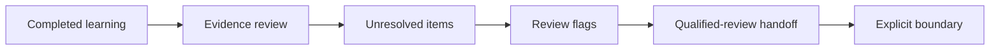
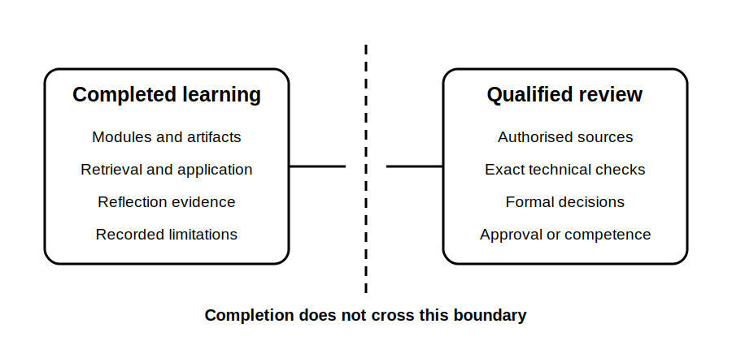

# Completion Reflection and Technical-Review Boundary

## 1. Outcome and entry check
By the end, the learner can summarise demonstrated learning, identify unresolved weaknesses, distinguish content completion from technical approval and create a qualified-review handoff.

**Entry check:** Explain why completing every learning block does not establish technical competence or compliance authority.

## 2. Why it matters
A program should close with evidence, not celebration alone. Clear completion boundaries prevent educational drafts, self-assessment results and plausible reasoning from being mistaken for authorised technical conclusions.

## 3. Core concepts and terminology
- **Content completion:** all planned learning blocks and artifacts exist.
- **Learning evidence:** observable outputs showing retrieval, application or reflection.
- **Technical review:** qualified checking against current authorised sources and practice requirements.
- **Approval boundary:** the exact claims the program does not make.
- **Handoff pack:** unresolved questions, flagged content and evidence prepared for a reviewer.
- **Next-step commitment:** one specific action following program completion.

## 4. Rule-finding workflow
1. Inventory completed modules and assessment artifacts.
2. Compare outcomes with the learner's evidence.
3. Identify persistent weaknesses and unresolved questions.
4. Separate educational confidence from technical certainty.
5. Collect every reference-check and review-required flag.
6. Build a concise qualified-review handoff.
7. Record one next-step commitment.
8. State the completion boundary explicitly.

## 5. Visual model or worked example

**Worked example:** The learner can produce a strong source-state map and bounded conclusion. The reflection records this as learning evidence while retaining review flags for any exact switching requirement, procedure or compliance decision.

## 6. Practical application
Create a one-page completion record containing five demonstrated capabilities, three persistent weaknesses, all unresolved reference questions, a reviewer handoff list and one next-step commitment. End with a precise statement of what completion does and does not establish.

Assessment evidence: evidence-based reflection, accurate boundary language, complete flag transfer, prioritised handoff and a specific next step.

## 7. Common errors and safety checkpoint
Common errors include equating completion with competence, hiding unresolved questions, removing review flags, using self-confidence as validation and describing draft content as approved guidance.

**Safety checkpoint:** No automated module is technically reviewed. Completion does not authorise field work, certify competence, approve designs, verify compliance or replace current authorised sources and qualified supervision.

## 8. Retrieval and next links
Without notes, state the eight-step completion workflow and the exact distinction between content completion and technical approval.

- Previous: [Block 62 — Final Cumulative Retrieval](block-62-final-cumulative-retrieval.md)
- Next: Program completion audit and qualified technical review
- Knowledge note: [Completion Reflection and Technical-Review Boundary](../../../knowledge-base/9-week/Block 63 - Completion Reflection and Technical-Review Boundary.md)